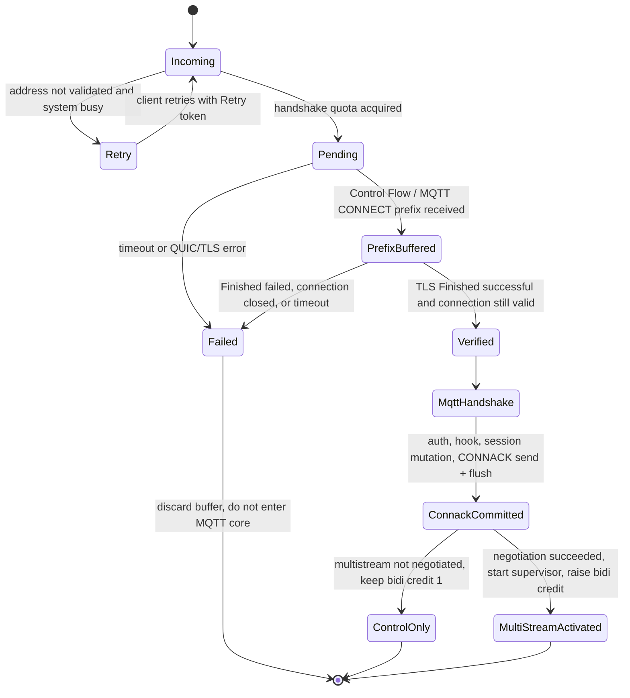

# MQTT over QUIC 0-RTT Data Replay Protection Design

Status: first version implemented
Scope: RMQTT `support-0RTT` branch, MQTT 3.1.1 / MQTT 5.0 over QUIC
Research basis: [mqtt-quic-0rtt-replay-research.md](./mqtt-quic-0rtt-replay-research.md)
Multistream companion design: [mqtt-quic-multistream.md](./mqtt-quic-multistream.md)

## 1. Decision Summary

The first RMQTT version provides only one safe 0-RTT profile: **handshake-gated CONNECT-only**.

This does not mean "execute MQTT CONNECT during 0-RTT". It means:

1. The client may send the bytes of the first MQTT CONNECT early;
2. Before TLS Finished, the Broker performs at most bounded protocol-prefix probing and buffering;
3. Authentication hooks, external authentication, old-connection kickout, Clean Start / Clean Session, Will registration, session creation, CONNACK, and any PUBLISH / SUBSCRIBE / AUTH handling must all happen only after TLS Finished has been confirmed successful;
4. TLS tickets use a listener/node-local stateful single-use store;
5. Ticket miss, cache eviction, node restart, or routing to the wrong node automatically degrades to 1-RTT instead of returning a business error;
6. The multistream listener exposes only one client bidi stream in handshake transport parameters. Data Flow is opened dynamically only after multistream negotiation succeeds and CONNACK send + flush commits;
7. The first version does not introduce MQTT nonces, CONNECT fingerprint caches, or a cluster replay ledger.

In one sentence: **0-RTT only moves transmission earlier; it does not create business side effects earlier.**

This is the most important safety boundary in this design, and it takes priority over all caches, nonces, and distributed locks.

## 2. Threat Model

### 2.1 Attacker Capabilities

Assume an attacker can:

- Capture and replay ClientHello, QUIC 0-RTT STREAM data, and CONNECT ciphertext verbatim;
- Replay before the legitimate client and consume a single-use ticket;
- Send a captured flight repeatedly to the same node, different nodes, or different availability zones;
- Create many unfinished handshakes, partial CONNECT payloads, or malformed MQTT prefixes;
- Observe whether a connection succeeds, but cannot break TLS, obtain the PSK, or compute a valid Client Finished for a new server handshake.

### 2.2 Side Effects to Protect

Replay must not cause any of the following actions:

- `client_connect`, `client_authenticate`, or similar hooks are called;
- External HTTP/JWT/ACL authentication requests are triggered repeatedly;
- The old connection with the same ClientId is kicked offline;
- Clean Start / Clean Session clears an old session;
- A Will is registered, replaced, or published;
- Session, subscription, retained-message, or offline-message state is modified;
- CONNACK or other application data that depends on client identity is sent before Finished;
- PUBLISH, SUBSCRIBE, UNSUBSCRIBE, AUTH, or other data-plane/control-plane packets are executed early.

### 2.3 Acceptable Residual Risk

This design allows replay to cause limited resource consumption, for example:

- Consuming one session ticket and making the legitimate client fall back to 1-RTT;
- Occupying one bounded handshake slot, a small amount of QUIC buffer, and protocol-probing CPU;
- Triggering QUIC Retry or connection timeout.

These are mitigable DoS risks. They must not escalate into MQTT state changes or external-system side effects.

### 2.4 Non-Goals

- It does not prevent an already legitimately authenticated client from reconnecting or publishing multiple times on purpose;
- It does not provide cross-connection exactly-once semantics for business PUBLISH messages;
- It does not solve attacks after endpoint PSK, session tickets, or client credentials have leaked;
- It does not treat MQTT QoS 2 as 0-RTT replay protection.

## 3. Implementation Status

The current implementation has landed the P0 safety boundary of this design:

- `rmqtt-net` uses a stateful TLS session store with atomic `take`, and disables stateless tickets;
- The endpoint initially grants only one client-initiated bidi Control Flow; uni-stream credit is 0;
- `Listener::next_quic()` first acquires a shared handshake permit and returns only a lightweight `QuicIncoming`;
- `QuicIncoming::accept_control()` uses one deadline for QUIC connection establishment, first Control Flow receive, and the TLS Finished gate;
- Before Finished, MQTT codec/version probing is not called, so application-layer bytes read is 0. The transport receive window still uses `pre_finished_read_budget` to limit Quinn early buffering;
- `handshake_data()` must exist and `close_reason()` must be empty before `AcceptedQuicControl` is returned;
- `server.rs` no longer touches raw `ZeroRttAccepted`; the legacy `accept_quic()` compatibility entry also reuses the same validation path;
- Only after CONNACK send + flush succeeds does the typestate token allow bidi stream credit to increase and the Data Flow supervisor to start.

On the Quinn server side, the boolean result of the `ZeroRttAccepted` future is not a business verdict for whether the server accepted early data. The current implementation only treats future completion as a gate signal and ignores the boolean. If an attacker replays an early CONNECT but cannot complete the new Finished, the Broker fails closed on timeout, missing handshake data, or closed connection, and never hands early MQTT bytes to v3/v5.

## 4. Core Safety Invariants

Implementation and code review must always verify these invariants:

1. **Finished gate**: only successfully verified QUIC/TLS connections may enter MQTT v3/v5 handlers.
2. **No pre-Finished side effect**: before Finished, do not call hooks, auth, shared/session, Will, CONNACK, or plugin interfaces.
3. **No 0.5-RTT application response**: keep rustls `send_half_rtt_data = false`; the application layer does not write responses before Finished.
4. **Control-only early stream**: before Finished and CONNACK send + flush commit, each MQTT/QUIC connection allows only one server-accepted client-initiated bidirectional Control Flow. Its early data can only be the first CONNECT. After multistream negotiation succeeds, commit may dynamically raise bidi stream credit to `1 + max_data_streams`; unnegotiated connections always stay at 1. Uni streams are always 0 in the first version.
5. **Stateful single-use ticket**: TLS 1.3 tickets usable for 0-RTT must be consumed by a stateful store with atomic `take`; stateless tickets are forbidden from entering the 0-RTT path.
6. **Safe fallback**: ticket miss, replay, expiry, capacity eviction, process restart, or wrong-node routing only causes 0-RTT failure and 1-RTT retransmission.
7. **Bounded pre-auth work**: before Finished, connection count, bytes read, buffering, parsing work, and wait time all have limits.
8. **Client exactly-one fallback**: after early data is rejected, the client retransmits CONNECT only once, and does not simultaneously wait for an early CONNACK while creating multiple fallback streams.

## 5. Recommended Architecture

### 5.1 Module Boundary

Add a QUIC/MQTT ingress deep module inside `rmqtt-net` to hide the fragile Quinn and rustls call order:

```rust
pub enum QuicZeroRttMode {
    Disabled,
    HandshakeGated,
}

pub struct QuicIncoming {
    // quinn::Incoming, listener policy, handshake permit; all fields are private
}

pub struct AcceptedQuicMqtt {
    pub control: MqttStream<QuinnBiStream>,
    pub meta: QuicIngressMeta,
    // activation handle is private; only typestate after CONNACK send + flush commit can use it
}

pub struct QuicIngressMeta {
    pub received_early_stream: bool,
    pub remote_addr: SocketAddr,
    pub address_was_validated: bool,
}

impl Listener {
    pub async fn next_quic(&self) -> Result<QuicIncoming>;
}

impl QuicIncoming {
    pub async fn accept_control(self) -> Result<AcceptedQuicMqtt>;
}
```

Internally, keep a non-exported pending state that holds the `Connection`, completion future, and MQTT stream together before validation completes:

```rust
struct PendingQuicMqtt {
    connection: quinn::Connection,
    completed: quinn::ZeroRttAccepted,
    control: MqttStream<QuinnBiStream>,
    permit: OwnedSemaphorePermit,
}
```

Only `PendingQuicMqtt::verify(self)` can construct the public `AcceptedQuicMqtt`; no field can be taken by `server.rs` early. After the Control writer completes CONNACK send + flush commit, a private activation handle starts the Data Flow supervisor and raises stream credit.

`QuicIncoming::accept_control()` is responsible for:

- `Incoming::accept()` / `Connecting::into_0rtt()`;
- Receiving the first bidirectional Control Flow;
- Not running MQTT version probing before Finished; the Quinn transport window only allows bounded early buffering;
- Jointly validating the TLS Finished completion signal and connection success state such as `Connection::close_reason()`;
- Discarding all early buffers when handshake times out or fails;
- Releasing the pre-Finished semaphore permit;
- Constructing and returning `AcceptedQuicMqtt` only after success;
- Not accepting, buffering, or starting any Data Flow task.

The completion gate should treat Quinn's boolean only as a "future has ended" signal, not as the server early-data verdict. The currently depended-on version can use the following shape and lock it with regression tests:

```rust
async fn await_verified_finished(
    connection: &quinn::Connection,
    completed: quinn::ZeroRttAccepted,
    deadline: tokio::time::Instant,
) -> Result<()> {
    // The server must not interpret this bool as an early-data acceptance verdict.
    let _ = timeout_at(deadline, completed)
        .await
        .map_err(|_| anyhow!("Timed out waiting for authenticated QUIC Finished"))?;
    if connection.handshake_data().is_none() {
        return Err(anyhow!("QUIC handshake data is unavailable"));
    }
    if let Some(reason) = connection.close_reason() {
        return Err(anyhow!("QUIC handshake did not establish a usable connection: {reason}"));
    }
    Ok(())
}
```

If a future Quinn version provides a server API that directly returns handshake success/failure, replace the implementation inside ingress, but do not change the external contract that "failure never returns an MQTT stream". When upgrading Quinn, rerun the gate contract tests. Do not apply client-side `accepted: bool` semantics to the server side, and do not continue assuming incoming success is always `true` without checking the new version source/documentation.

`rmqtt/src/server.rs` may only receive `AcceptedQuicMqtt`, not a pending stream or raw `ZeroRttAccepted`. Only after v3/v5 completes CONNECT/auth and the Control writer successfully sends + flushes CONNACK can it be converted into `QuicMultiStreamLink`. This makes "forgot to check Finished" and "opened Data Flow before CONNACK commit" inexpressible errors.

### 5.2 State Machine



### 5.3 Normal and Replay Sequences

Normal path:

1. The client uses a ticket obtained from the previous connection and sends ClientHello + CONNECT on the Control Flow;
2. rustls performs atomic `take` on the ticket and validates binder, age, ALPN, and transport resumption conditions;
3. ingress only probes the MQTT version and retains bytes; it does not call MQTT core;
4. The legitimate client completes the new TLS Finished;
5. ingress returns the verified Control Flow;
6. v3/v5 parses CONNECT normally, authenticates, and creates the session.
7. Only if multistream negotiation succeeded, after CONNACK send + flush commit, raise `MAX_STREAMS` and accept Data Flow. Otherwise remain Control-only.

Passive replay path:

1. The attacker replays ClientHello + CONNECT;
2. If the ticket has already been consumed, rustls rejects early data and the connection may continue with a full handshake; the attacker cannot complete it and eventually closes;
3. If the attacker consumes the ticket first, the Broker may temporarily store the CONNECT prefix, but the attacker still cannot generate a valid Finished for the new handshake;
4. The Finished gate returns an error and discards the buffer;
5. The legitimate client observes early data rejected and sends CONNECT again on the completed 1-RTT connection;
6. Throughout the process there are no hooks, old-session kickout, Will, CONNACK, or other MQTT side effects.

## 6. TLS Ticket Defenses

### 6.1 First-Version Strategy

Each QUIC listener uses a node-local, stateful, single-use session store:

```rust
#[derive(Debug)]
pub struct ReplaySafeSessionStore {
    // bounded cache<Entry { tls_value, insertion_time, profile_fingerprint }> + metrics
}

pub struct ZeroRttProfileFingerprint {
    // hash(ALPN/protocol set, initial stream limits, credential profile,
    //      multistream mode, packet/read limits, auth_policy_epoch)
}

impl rustls::server::StoresServerSessions for ReplaySafeSessionStore {
    fn put(&self, key: Vec<u8>, value: Vec<u8>) -> bool;
    fn get(&self, key: &[u8]) -> Option<Vec<u8>>;
    fn take(&self, key: &[u8]) -> Option<Vec<u8>>; // must atomically return and delete
    fn can_cache(&self) -> bool;
}
```

Implementation constraints:

- `take` must perform lookup and deletion in the same critical section;
- The cache must have capacity and local TTL;
- On `put`, record the current `ZeroRttProfileFingerprint`; `get` / `take` only return a session whose fingerprint matches exactly. A mismatch is equivalent to ticket miss and falls back to 1-RTT;
- Do not log ticket keys, PSKs, or session values;
- When the store is unavailable or reaches a security failure condition, do not issue new 0-RTT-capable tickets;
- For the rustls 0.23 TLS 1.3 path, treat `put(...) == false` as the authoritative signal for "do not issue this ticket"; `can_cache()` remains only for trait compatibility and advisory semantics;
- `ticketer` must remain disabled;
- Do not share the store between listeners whose authentication policy, certificate identity, or ALPN are not equivalent.

The fingerprint must explicitly include `auth_policy_epoch`. The Broker cannot stably hash arbitrary external policies from authentication plugins, so when authentication rules, token audience, credential profile, or plugin configuration changes in a security-relevant way, operations/config loading must increase this epoch. Multistream enablement, initial bidi/uni limits, early CONNECT read budget, ALPN/protocol set, and similar settings can be calculated automatically into the fingerprint.

The current rustls default `ServerSessionMemoryCache` already performs atomic deletion under lock and disables the default stateless ticketer. The value of an explicit store is to make capacity, TTL, metrics, and security constraints an RMQTT-configurable and testable contract instead of relying on implicit defaults.

### 6.2 Why Not Use a CONNECT Fingerprint Cache

Do not use `ClientId + CONNECT hash + IP` as the primary replay key:

- The same CONNECT is legitimate during normal reconnect;
- IP is unstable under NAT, mobile networks, and QUIC migration;
- Before Finished there is no trusted MQTT identity;
- A fingerprint cannot replace TLS ticket binder, freshness, and ALPN binding;
- It introduces false positives, additional memory, and new cluster-consistency problems.

Ticket identity is consumed by the TLS layer, which is the correct security and locality boundary.

## 7. MQTT 0-RTT Profile

### 7.1 Allowed Client Behavior

- Send early data only on the first client-initiated bidirectional Control Flow;
- Early data may contain only the first CONNECT. It may be fragmented, but must not append PUBLISH, SUBSCRIBE, UNSUBSCRIBE, AUTH, PINGREQ, or DISCONNECT;
- On the client side, do not send any subsequent MQTT packet before `ZeroRttAccepted == true` and before CONNACK is received. The server must not reuse this boolean semantics;
- If 0-RTT is not accepted, discard early stream state, open a new stream on the same QUIC connection after handshake completion, and retransmit CONNECT exactly once;
- If reads or writes on the early stream return `ZeroRttRejected` first, enter the same fallback state. That error and `accepted == false` may trigger only one once-only retransmission;
- Do not wait indefinitely for an early CONNACK before deciding whether 0-RTT was accepted, or early-data rejection can deadlock the client.
- Do not create Data Flow before CONNACK send + flush commit. Dynamic `MAX_STREAMS` received on the previous connection cannot be used for 0-RTT on the next connection.

Recommended client state uses one state machine to guarantee idempotent retransmission:

```text
Initial
  -> EarlyConnectSent
      -> accepted=true  -> WaitConnack
      -> accepted=false -> FallbackConnectSent -> WaitConnack
  -> OneRttConnectSent  -> WaitConnack
  -> Connected
```

### 7.2 Broker Behavior

- Before Finished, probe at most CONNECT fixed header, remaining length, protocol name, and protocol version;
- Do not fully parse username, password, Will, or properties before Finished;
- Even if the complete CONNECT has already been buffered by Quinn, it must only be handed to v3/v5 after the verified gate;
- Malformed early prefixes do not return MQTT CONNACK before Finished; they may silently close, Retry, or use a limited QUIC transport close;
- Normal MQTT error mapping is used only after Finished.
- A multistream listener enters `Activated` only after negotiation succeeds on the current connection and CONNACK send + flush commits. Only then may bidi stream credit be raised dynamically. Unnegotiated connections keep 1. Any pre-activation extra stream must not trigger MQTT core.

### 7.3 Credential Restrictions

TLS 1.3 0-RTT does not provide forward secrecy. Even if this design prevents replay side effects, it cannot remove the confidentiality risk of placing long-lived credentials in early data.

This restriction must be an executable configuration contract, not merely a check after runtime parsing. The Broker sees the complete CONNECT only after Finished. Rejecting a long-lived password at that point cannot undo the fact that it entered 0-RTT ciphertext without forward secrecy.

Recommended explicit configuration:

```toml
[listener.quic.external.zero_rtt]
mode = "handshake_gated"
credential_profile = "short_lived_token" # deny | anonymous | short_lived_token
auth_policy_epoch = 1
```

Mandatory policy:

- `credential_profile` defaults to `deny`; 0-RTT cannot be enabled without an explicit declaration;
- Only anonymous listeners or controlled short-lived, revocable token profiles are allowed;
- The `short-lived-token` profile must disable anonymous access on the listener;
- MQTT 3.1.1 and MQTT 5 listeners that allow long-lived username/password disable 0-RTT by default;
- 0-RTT-capable client SDKs must refuse to write long-lived passwords into early CONNECT;
- MQTT 5 may continue enhanced authentication after Finished, but cannot send long-lived Authentication Data early;
- mTLS + 0-RTT remains incompatible in the first version.

The Broker cannot automatically determine whether an arbitrary plugin token is truly "short-lived". Enabling `short-lived-token` is therefore an auditable operations assertion, and should at least constrain token TTL, audience, listener, ClientId/principal binding, and revocation method.

## 8. Resource Replay and DoS Protection

After business side effects are blocked by the Finished gate, the remaining focus is bounding pre-auth cost.

### 8.1 QUIC Transport Limits

- Before endpoint creation, call `transport_config.max_concurrent_bidi_streams(1_u8.into())`;
- Also call `transport_config.max_concurrent_uni_streams(0_u8.into())`;
- Keep bidi credit at 1 before CONNACK send + flush commit;
- After commit, first enter `Activated` locally and start the supervisor with phase guards, then call `set_max_concurrent_bi_streams(1 + max_data_streams)`;
- When Control Flow ends, close the entire QUIC connection; manage Data Flow lifecycle independently according to the multistream design;
- Set reasonable `stream_receive_window` and `receive_window` values based on the listener `max_packet_size`;
- Keep a finite `max_idle_timeout` and an independent handshake timeout;
- Do not treat `max_early_data_size` as an ordinary byte-limit setting: QUIC/rustls only accepts `0` or `0xffffffff`; actual memory boundaries should be implemented with flow control, read budgets, and concurrency limits.

Dynamically raised `MAX_STREAMS` only authorizes 1-RTT Data Flow. The initial bidi limit remembered in tickets must remain 1. When deploying this policy, clear or rotate old resumption tickets that may remember a higher limit.

### 8.2 Pre-Finished Quota

Each listener should maintain at least:

- A global pending-handshake semaphore;
- Per-IP or IPv4 `/24`, IPv6 `/56` prefix rate limits;
- A pre-Finished read budget;
- Protocol-probing CPU/error-count limits;
- Per-connection and total handshake timeouts.

Do not wait for the first stream inside the listener accept loop. Accept `Incoming` first, then let a task that holds the permit process it.

The `next_quic()` split, pending semaphore, Control Flow `accept_bi()` timeout, prefix read timeout/budget, initial bidi-stream limit, and CONNACK commit activation gate are all P0 prerequisites before enabling 0-RTT. They are not later performance optimizations.

### 8.3 Address Validation and Retry

Use Quinn `Incoming::remote_address_validated()` / `may_retry()`:

- Allow the fast path under normal load;
- When pending count, memory, or error rate exceeds thresholds, send QUIC Retry for unvalidated addresses;
- If no permit can be obtained, prefer Retry, then ignore/refuse;
- Retry sacrifices 0-RTT latency, so use it adaptively instead of unconditionally.

## 9. Cluster Strategy

### 9.1 Recommendation: Node-Local Tickets

The first version does not synchronize TLS replay state through RMQTT cluster-broadcast, Redis, or Raft.

- A ticket is usable only on the listener/process that issued it;
- When routed to another node, after process restart, or after cache eviction, 0-RTT is rejected and the client falls back to 1-RTT;
- If hit rate matters, use load-balancer affinity or ticket-owner routing, but security must not depend on affinity;
- Do not put an eventually consistent store in the anti-replay path to improve hit rate.

This locality choice limits the worst case to "one missed performance benefit" instead of "MQTT side effects executed repeatedly across nodes".

### 9.2 Future Shared-Ticket Requirements

If the same ticket must be resumable across multiple nodes in the future, the shared store's `take` must be a linearly consistent cross-node atomic consume. Broadcast or a normal eventually consistent Redis GET/DEL combination is not acceptable.

Also note that rustls `StoresServerSessions` is a synchronous interface. Putting Raft or remote RPC directly into the TLS handshake hot path causes blocking and availability coupling. Priority should be:

1. ticket-owner routing;
2. safe fallback to 1-RTT when routing is not possible;
3. only then evaluate a low-latency, linearly consistent shared session store.

## 10. Alternative Comparison

This design evaluated four shapes in parallel:

| Option | Pros | Problems | Conclusion |
| --- | --- | --- | --- |
| A. transport ingress + CONNECT fingerprint cache | Small interface, v3/v5 mostly unchanged | Fingerprint is not a reliable TLS replay identity and may falsely reject normal reconnect | Use ingress; do not use fingerprint cache |
| B. MQTT token + policy + replay ledger | Can allow true early execution by listener/client/packet | Many interfaces and failure modes, cluster RTT offsets 0-RTT benefit, MQTT 3.1.1 lacks a clean token carrier | Keep only as a future MQTT 5 extension |
| C. operator policy + local cache + automatic fallback | Operations-friendly, includes Retry, metrics, and fallback concepts | Quinn does not expose a stable ticket key suitable for a separate cache; rustls already consumes tickets at the right layer | Use policy/fallback/metrics; put cache in the rustls store |
| D. AdmissionGate + local/Raft adapters | Clear port boundary; testable strongly consistent reserve/consume | Duplicate mechanism when no pre-Finished business execution is allowed; adds latency and dependencies | Do not use in the first version |

The final choice is a convergence of A and C:

- Use a deep ingress module to hide the Finished gate;
- Use the rustls session store for single-use ticket consumption;
- Use listener-local policy, resource limits, Retry, and metrics for operability;
- Keep MQTT core and the cluster hot path unaware of a replay ledger.

## 11. Observability

Recommended metrics, all labeled by listener identifier to avoid high-cardinality ClientId labels:

- `quic_early_stream_received_total`;
- `quic_finished_success_after_early_total`;
- `quic_finished_failure_after_early_total`;
- `quic_handshake_timeout_total`;
- `quic_ticket_store_put_total`;
- `quic_ticket_take_hit_total`;
- `quic_ticket_take_miss_total`;
- `quic_ticket_evicted_total`;
- `quic_retry_issued_total`;
- `quic_prefinished_limit_rejected_total`;
- `quic_prefinished_connections`;
- `quic_prefinished_bytes`;
- `quic_handshake_duration_seconds`.

Metric sources must align with implementation seams:

| Metric category | Only trusted collection point |
| --- | --- |
| ticket put/take hit/miss/evict | inside `ReplaySafeSessionStore` |
| early Control Flow, Finished success/failure, timeout | `PendingQuicMqtt::verify` |
| Retry, pending limit | `Listener::next_quic` |
| pre-Finished bytes | ingress limited reader / stream wrapper |
| hook/auth/kick/CONNACK zero-side-effect assertions | test-only hook, shared/session spy, and stream writer spy |

Logs must not output raw tickets, PSKs, passwords, Authentication Data, or complete CONNECT payloads. Do not log unauthenticated ClientId before Finished. If correlation is required, log only short-lived salted digests.

## 12. Failure Semantics

| Scenario | Broker behavior | Client behavior |
| --- | --- | --- |
| ticket consumed/expired/evicted | Do not process early stream; continue full handshake | Retransmit CONNECT once after handshake completes |
| routed to wrong node | Same as above | Same as above |
| captured replay burns ticket first | Temporarily store bounded prefix; discard everything after Finished failure | Legitimate connection falls back to 1-RTT |
| Finished failure or connection closed early | Do not enter v3/v5; do not send CONNACK | Create a new normal connection |
| pending quota insufficient | adaptive Retry, ignore, or refuse | Connect according to QUIC retry policy |
| session store unavailable | fail closed for early data; do not issue new 0-RTT ticket | Use 1-RTT |
| MQTT CONNECT invalid | After Finished, close/reject by normal MQTT rules | Correct the protocol request |

## 13. Verification Plan

### 13.1 Unit Tests

- 100 concurrent `take` calls use the same ticket, and exactly one returns the session;
- Ticket TTL, capacity eviction, and no resumable ticket / no 0-RTT capability when `put=false`; `can_cache()` only gets compatibility/advisory tests;
- Gate returns error when the connection has a close reason after the Finished signal;
- With Quinn 0.11.9 pinned, the completion future is used only as a completion gate; missing handshake data or non-empty close reason makes the gate fail closed, and the bool is not interpreted as a server early-data acceptance verdict;
- Finished timeout, stream timeout, and prefix read budget;
- Pending permit is released on all error paths;
- Fallback state machine retransmits CONNECT only once when multiple failure signals happen concurrently.
- When any security field or `auth_policy_epoch` in `ZeroRttProfileFingerprint` changes, old tickets can only fall back to 1-RTT.

### 13.2 Integration Tests

- Legitimate 0-RTT CONNECT succeeds, and CONNACK is sent after Finished;
- After sending early CONNECT, interrupt the connection before Finished: hook/auth/kick/session/Will/CONNACK counters are all 0;
- Concurrent replay with the same ticket: at most one early acceptance, and the legitimate client can complete through 1-RTT;
- Replayer burns ticket first: no MQTT side effects, original client fallback succeeds;
- Cache eviction, node restart, and wrong node all degrade without business errors;
- A second bidi stream and all uni streams before Finished/CONNACK commit are blocked by transport limits;
- After the previous connection enabled Data Flow, the next 0-RTT using its ticket can still create only Control Flow;
- After CONNACK send + flush commit, only the configured number of Data Flows open; pre-activation extra streams have 0 MQTT side effects;
- After early rejection, the client does not wait forever and does not send two fallback CONNECT packets;
- Fuzz/property tests for malformed, truncated, and oversized CONNECT;
- Resource-bound pressure tests under adaptive Retry and pending limits.

### 13.3 Security Acceptance Criteria

In packet-capture replay tests, regardless of replay count, order, or target node, if the attacker cannot complete a new TLS Finished, all of the following must hold:

```text
auth_hook_calls      == 0
external_auth_calls  == 0
session_kicks        == 0
session_mutations    == 0
will_registrations   == 0
connack_sent         == 0
publish_processed    == 0
```

## 14. Phased Rollout

### P0: Fix the Safety Boundary

- Introduce the verified Finished gate;
- Discard stream on failure or non-empty close reason;
- Hide the pending QUIC Control Flow inside the ingress deep module;
- Split endpoint accept from `accept_bi()` so a single slow client cannot block the accept loop;
- Add pending semaphore, `accept_bi()`/prefix/Finished timeouts, and pre-Finished read budget;
- Set endpoint transport config initially with `max_concurrent_bidi_streams(1)` and `max_concurrent_uni_streams(0)`; only dynamically open Data Flow after CONNACK send + flush commit; close the QUIC connection when Control Flow ends;
- Clear or rotate old resumption tickets that may remember a higher initial stream limit;
- Enforce `credential_profile` validation for 0-RTT listeners; long-lived password profiles cannot start 0-RTT;
- Add "early bytes + Finished failure = zero side effects" regression tests.

### P1: Explicit Single-Use Ticket and Resource Limits

- Configure and test `ReplaySafeSessionStore`;
- Add adaptive Retry, IP/prefix rate limits, and finer resource metrics;
- Add replay/0-RTT metrics;
- Implement the client accepted/rejected fallback state machine.

### P2: Gray Release and Operations

- Keep 0-RTT disabled by default and enable it gradually per listener;
- First enable it on listeners without long-lived passwords and without mTLS;
- Observe ticket miss, Finished failure, Retry, and fallback ratios;
- On anomaly, switch back to `Disabled`; normal QUIC 1-RTT is unaffected.

### P3: Optional True Early Execution

Only if MQTT business actions must explicitly execute before Finished, introduce an MQTT 5 one-time token + `reserve/commit/revoke` ledger, and limit it to a narrow profile with no Will, no Clean Start, no enhanced auth, and fixed identity/ClientId. This mode requires an independent threat model and security review. It is not part of the first version of this design.

## 15. Specification and Implementation Basis

- [TLS 1.3 RFC 8446 Section 8: 0-RTT and anti-replay](https://datatracker.ietf.org/doc/html/rfc8446#section-8)
- [QUIC TLS RFC 9001 Section 9.2: 0-RTT replay](https://datatracker.ietf.org/doc/html/rfc9001#section-9.2)
- [QUIC RFC 9000 Section 4.6: 0-RTT transport parameters and rejection](https://datatracker.ietf.org/doc/html/rfc9000#section-4.6)
- [QUIC RFC 9000 Section 7.4.1: 0-RTT remembered transport parameters](https://www.rfc-editor.org/rfc/rfc9000.html#section-7.4.1)
- [QUIC RFC 9000 Section 19.11: MAX_STREAMS](https://www.rfc-editor.org/rfc/rfc9000.html#section-19.11)
- [Quinn 0.11.9 `Connecting::into_0rtt`](https://docs.rs/quinn/0.11.9/quinn/struct.Connecting.html)
- [rustls 0.23.40 `ServerConfig`](https://docs.rs/rustls/0.23.40/rustls/server/struct.ServerConfig.html)
- [rustls 0.23.40 `StoresServerSessions`](https://docs.rs/rustls/0.23.40/rustls/server/trait.StoresServerSessions.html)
- [MQTT 3.1.1 OASIS Standard](https://docs.oasis-open.org/mqtt/mqtt/v3.1.1/os/mqtt-v3.1.1-os.html)
- [MQTT 5.0 OASIS Standard](https://docs.oasis-open.org/mqtt/mqtt/v5.0/os/mqtt-v5.0-os.html)
