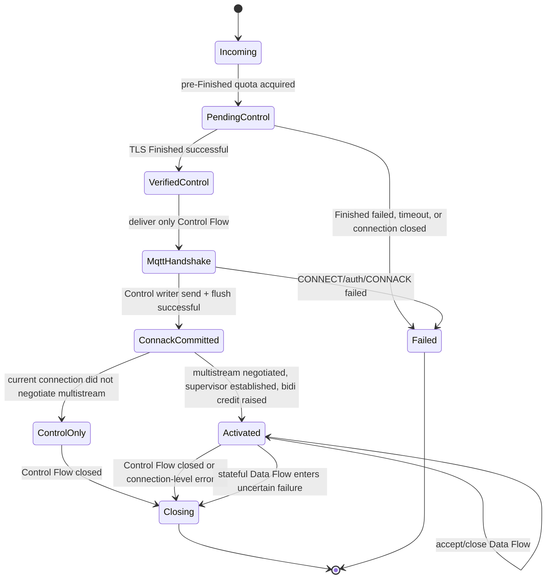

# MQTT over QUIC Multistream Design

Status: first version implemented
Scope: RMQTT `support-0RTT` branch, MQTT 3.1.1 / MQTT 5.0 over QUIC
Research basis: [mqtt-quic-multistream-research.md](./mqtt-quic-multistream-research.md)
Safety prerequisite: [mqtt-quic-0rtt-replay-protection.md](./mqtt-quic-0rtt-replay-protection.md)

## 1. Decision Summary

The first RMQTT version uses the **Simple Multistream** profile:

1. One QUIC connection maps to exactly one MQTT Network Connection and one MQTT session;
2. The first client-initiated bidirectional stream actually accepted by the server is the persistent **Control Flow**;
3. Control Flow carries CONNECT, CONNACK, AUTH, PING, and DISCONNECT, and can act as the compatibility fallback for all MQTT packets;
4. Only after TLS Finished is verified, CONNECT/auth succeeds, and the Control writer commits CONNACK send + flush does the Broker allow additional client-initiated bidirectional **Data Flow**;
5. Data Flow can carry PUBLISH/QoS ACK chains and SUBSCRIBE/UNSUBSCRIBE transactions. Responses must return on the same flow that initiated the transaction;
6. MQTT Packet Identifier, Receive Maximum, session, inflight, Keep Alive, and Will are always connection/session-level state. They cannot be partitioned by flow;
7. QUIC only guarantees ordering inside one flow. RMQTT does not promise global ordering across flows; data with causal or ordering relationships must be placed on the same flow;
8. MQTT 5 Topic Alias is disabled in the first multistream profile;
9. Flow binding is temporary state for the current QUIC connection and is not written into the persistent MQTT session;
10. The first version does not use server-initiated streams, unidirectional streams, QUIC DATAGRAM, one stream per message, or persistent FlowId.

The combined 0-RTT and multistream rule is one sentence:

> **0-RTT can only carry the first CONNECT on Control Flow; Data Flow must wait until Finished + CONNACK.**

This profile is an optional RMQTT extension, not a published OASIS MQTT multistream standard. Cross-product interoperability must be confirmed with compatibility tests and cannot be inferred solely from MQTT version or the `mqtt` ALPN.

## 2. Goals and Non-Goals

### 2.1 Goals

- Avoid letting one slow topic or large PUBLISH block PING, authentication, and other independent topics;
- Let clients choose independent flows by topic, QoS, or publish/subscribe direction;
- Keep the existing RMQTT session actor as the single owner of global MQTT state;
- Let single-stream clients use only Control Flow;
- Compose with the handshake-gated CONNECT-only 0-RTT replay defense instead of expanding the early-data execution surface;
- Hide Quinn stream, Finished gate, flow task, and reset details inside a transport deep module.

### 2.2 Non-Goals

- No global message ordering across flows;
- No cross-connection exactly-once;
- No model where each QUIC stream becomes an independent MQTT session;
- No first-version persistence of flow, subscription-to-flow binding, or stream priority;
- No automatic migration of ambiguous QoS transactions from a failed flow to another flow;
- No promise of wire-level compatibility with arbitrary third-party MQTT-over-QUIC multistream implementations.

## 3. Why Not Just Loop `accept_bi()`

Before this change, `Listener::accept_quic()` accepted one bidirectional stream, `server.rs` handed that stream to v3/v5, and `SessionState::run` processed send/receive serially around a single `Sink`. The current implementation replaces this boundary with the `QuicIncoming -> AcceptedQuicControl -> ConnackCommitted -> QuicMultiStreamLink` typestate chain.

Putting `accept_bi()` directly in a loop would break these implicit contracts:

- It is unclear which stream owns CONNECT/CONNACK and connection close authority;
- The same Packet Identifier can be allocated repeatedly on different streams;
- ACK can complete the QoS state machine for another flow on the wrong stream;
- Ownership of Keep Alive, Will, session takeover, and Topic Alias becomes scattered;
- Multiple reader tasks can concurrently mutate the same session;
- A 0-RTT client can use stream credit remembered from the previous connection to open data streams early;
- Stream reset can be mistaken for whole MQTT connection closure, or the reverse can hide a real connection close.

Therefore, a real transport seam is required: the upper layer sees one MQTT link and its logical flows, not several raw Quinn streams.

## 4. Wire Profile

### 4.1 Control Flow

Control Flow is the first client-initiated bidirectional stream actually accepted by the server on the current QUIC connection, and it lives until the MQTT connection ends. If 0-RTT is rejected, the client's locally invalid early stream does not count for this definition; the post-handshake fallback stream becomes the server-visible Control Flow.

Control-only packets:

- CONNECT / CONNACK;
- MQTT 5 AUTH; current RMQTT explicitly rejects enhanced auth, and if supported in the future it must still use Control Flow;
- PINGREQ / PINGRESP;
- DISCONNECT;
- Broker connection-level errors and close notifications.

To preserve single-stream compatibility, Control Flow also allows PUBLISH, PUBACK/PUBREC/PUBREL/PUBCOMP, SUBSCRIBE/SUBACK, and UNSUBSCRIBE/UNSUBACK. Clients that do not enable multistream do not need to change existing behavior.

Control Flow reset, read-side EOF, or unrecoverable codec error is equivalent to loss of the MQTT Network Connection: stop all Data Flow, execute existing disconnect/session/Will semantics, and close the QUIC connection.

### 4.2 Data Flow

After successful CONNACK, the client may create zero or more additional bidirectional Data Flows. The first version does not add a custom stream header. All Data Flows:

- Automatically inherit the MQTT 3.1.1 or MQTT 5.0 codec already determined by Control Flow;
- Can continuously carry multiple MQTT Control Packets;
- Are allocated by the client according to topic, QoS, or publish/subscribe direction;
- Can only be used inside the current QUIC connection and cannot be resumed across connections;
- Must not carry CONNECT, CONNACK, AUTH, PINGREQ, PINGRESP, or DISCONNECT.

Clients may use the following mappings, but RMQTT does not require a fixed lane:

- One topic or a set of ordered topics uses the same flow;
- QoS 0, QoS 1, and QoS 2 use different flows;
- Uplink publish and downstream subscription use different flows;
- All data continues to use Control Flow.

### 4.3 Complete Packet/Phase Matrix

`Handshake-phase Control` means Finished has been verified but successful CONNACK has not committed. The 0-RTT phase is stricter than this column and only allows bytes of the first CONNECT.

| Packet family | Direction | Handshake-phase Control | Activated Control | Activated Data | Illegal Data Flow handling |
| --- | --- | --- | --- | --- | --- |
| CONNECT | Client -> Broker | Must be the first packet, only once | Repeated CONNECT forbidden | Forbidden | Close connection |
| CONNACK | Broker -> Client | Only sent by handshake commit | Repeated CONNACK forbidden | Forbidden | Internal invariant failure, close connection |
| AUTH (MQTT 5) | Bidirectional | Future support only on Control; current RMQTT rejects | Future re-auth still Control-only | Forbidden | Close connection |
| PUBLISH | Bidirectional | 1-RTT packets arriving after complete CONNECT may be queued in bounded form, but are not executed before CONNECT/auth succeeds; Broker does not send | Allowed | Allowed | Classify by codec/QoS error |
| PUBACK / PUBREC / PUBREL / PUBCOMP | Bidirectional | Not executed; protocol error when no legal transaction exists | Allowed, must match route | Allowed, must match same-flow route | wrong-flow or illegal stage closes connection |
| SUBSCRIBE | Client -> Broker | 1-RTT may be queued in bounded form, not executed before CONNACK commit | Allowed | Allowed | malformed/PacketId conflict closes connection |
| SUBACK | Broker -> Client | Not sent | Allowed, reply on original flow | Allowed, reply on original flow | Send-path mismatch is an internal error |
| UNSUBSCRIBE | Client -> Broker | 1-RTT may be queued in bounded form, not executed before CONNACK commit | Allowed | Allowed | malformed/PacketId conflict closes connection |
| UNSUBACK | Broker -> Client | Not sent | Allowed, reply on original flow | Allowed, reply on original flow | Send-path mismatch is an internal error |
| PINGREQ / PINGRESP | Client -> Broker / Broker -> Client | Not executed / not sent | Control-only | Forbidden | Reset Data Flow; do not refresh Keep Alive |
| DISCONNECT | Bidirectional, by MQTT version rules | Control-only; terminates handshake/session | Control-only | Forbidden | Close connection |

Every packet must pass phase, flow-kind, direction, and MQTT-version validation before it refreshes Keep Alive or enters the session actor. If CONNECT is eventually rejected, all subsequent packets queued during the handshake phase are discarded.

### 4.4 Same-Flow Responses

These transactions must complete on the flow where the initiating packet appeared:

| Initiating packet | Same-flow response / subsequent chain |
| --- | --- |
| QoS 1 PUBLISH | PUBACK |
| QoS 2 PUBLISH | PUBREC -> PUBREL -> PUBCOMP |
| SUBSCRIBE | SUBACK; successful subscription binds that flow |
| UNSUBSCRIBE | UNSUBACK; corresponding binding removed after success |
| Broker downstream QoS 1/2 PUBLISH | Client ACK chain returns to the flow that sent the PUBLISH |

An ACK appearing on another flow cannot be accepted solely by Packet Identifier. It is a connection-level protocol/security error, because the wrong ACK can release inflight early, reuse a Packet Identifier, or corrupt the QoS 2 state machine.

### 4.5 Negotiation

The first version keeps the existing MQTT QUIC ALPN and makes multistream an opt-in profile on the listener:

- MQTT 5 clients should request `rmqtt-quic-multistream=simple-v1` in CONNECT User Property. The Broker enables Data Flow only after it explicitly accepts this in CONNACK;
- `multistream.negotiation="strict"` (the default) preserves that explicit negotiation; a dedicated compatibility listener may use `"preconfigured"` so legacy clients that cannot send the property still activate `simple-v1`, while the Broker continues to return `rmqtt-quic-multistream=simple-v1` in CONNACK;
- MQTT 3.1.1 has no User Property and must use a dedicated listener/port or mutual preconfiguration;
- Seeing extra QUIC stream credit is not equivalent to successful application-layer negotiation. The client must still wait for successful CONNACK;
- Clients that did not negotiate or are unsupported always use Control Flow.

If strict isolation from non-RMQTT clients is required in the future, design and register a dedicated ALPN separately. The first version does not claim an unregistered ALPN as a standard value.

## 5. Connection State Machine



Activation order must be:

1. Verify TLS Finished; discard Control Flow buffer on failure;
2. Complete MQTT CONNECT/auth/session takeover on Control Flow;
3. The Control Flow writer executes `send` + `flush` for CONNACK. Only after both succeed does it generate an unforgeable `ConnackCommitted` token. This only means the local writer has committed; it does not mean the peer has received it;
4. If send/flush fails or hits a backpressure timeout, close the connection and never raise stream credit;
5. If the current connection did not negotiate multistream, enter `ControlOnly` and keep bidi credit permanently at 1;
6. If negotiated, use the token to construct an `Activated` link and start the phase-guarded Data Flow accept supervisor;
7. Finally, raise the peer's concurrent bidirectional stream count to `1 + max_data_streams`.

Even if network reordering lets the client see `MAX_STREAMS` first, the client must not send Data Flow before parsing a successful CONNACK. The Broker resets/closes extra streams when not in `Activated` state and must not produce MQTT side effects.

## 6. 0-RTT and Stream Credit

### 6.1 Initial Transport Parameters

A 0-RTT-capable listener must set this before QUIC endpoint creation:

```rust
let transport_config = Arc::get_mut(&mut server_config.transport).unwrap();
transport_config.max_concurrent_bidi_streams(1_u8.into());
transport_config.max_concurrent_uni_streams(0_u8.into());
```

This single bidi credit is only for Control Flow. Do not use Quinn defaults first and then lower to 1 after accept, because the client may already have opened extra streams according to handshake parameters or an old ticket.

### 6.2 Dynamic Opening After CONNACK

Quinn 0.11 provides:

```rust
connection.set_max_concurrent_bi_streams((1 + policy.max_data_streams).into());
```

This call increases the number of streams the peer may open through QUIC `MAX_STREAMS`. RFC 9000 states that 0-RTT packets can only use transport parameters remembered by the ticket; credit raised by handshake or 1-RTT frames can only be used by 1-RTT. Therefore:

- The ticket-remembered `initial_max_streams_bidi` is always 1;
- Dynamic `MAX_STREAMS` received after CONNACK on the previous connection cannot authorize early Data Flow on the next connection;
- When accepting 0-RTT, the server cannot lower the remembered initial limit to a smaller value, but it can raise the limit after handshake;
- Any attempt to use a second client bidi stream in 0-RTT violates the remembered limit and must fail at the transport/ingress boundary.

When upgrading to this profile, clear or rotate the old listener's resumption ticket store. If old tickets remember an initial stream count greater than 1, their 0-RTT must not continue to be accepted.

### 6.3 Early Rejection Fallback

The client fallback state machine manages only Control Flow:

- early data accepted: continue waiting for CONNACK on Control Flow;
- early data rejected: discard local early-stream state, open exactly one fallback Control Flow on the same QUIC connection after handshake completion, and retransmit CONNECT exactly once;
- never create Data Flow before successful CONNACK;
- failure signals from fallback and the early stream must converge into one once-only state transition, and must not create two Control Flows repeatedly.

## 7. Deep Module and Interfaces

### 7.1 Module, Seam, and Adapters

| Design concept | Location and responsibility |
| --- | --- |
| module | `rmqtt-net::quic_ingress` hides Finished, 0-RTT, stream credit, and accept supervisor |
| interface | `MqttLink`, `LinkEvent`, and `ReplyPath` are session-facing contracts |
| seam | `server.rs` only receives a verified pending link; it does not touch raw `ZeroRttAccepted` or `quinn::Connection` |
| adapter | `SerialMqttLink` adapts TCP/TLS/WS/single-stream QUIC; `QuicMultiStreamLink` adapts multistream; `MemoryMqttLink` is for tests |
| depth | flow task, codec, reset, buffer, priority, and connection cancellation remain in `rmqtt-net` |
| leverage | v3/v5 auth, SessionState, inflight, subscription, Will, and hooks keep one implementation |
| locality | ticket/policy belongs to listener; flow registry belongs to connection; MQTT state belongs to session |

Recommended transport-neutral shape:

```rust
pub struct FlowId(/* opaque: connection epoch + stream identity */);

pub struct ReplyPath {
    flow: FlowId,
    generation: u64,
}

pub enum FlowKind {
    Control,
    Data,
}

pub enum LinkEvent<P> {
    Packet {
        packet: P,
        kind: FlowKind,
        reply: ReplyPath,
    },
    FlowClosed {
        flow: FlowId,
        reason: FlowCloseReason,
    },
    ConnectionClosed(ConnectionCloseReason),
}

pub enum SendTarget {
    Control,
    Reply(ReplyPath),
    Bound(FlowId),
}

pub struct SendReceipt {
    pub path: ReplyPath,
}

pub struct PendingMqttLink<P> {
    control: ControlChannel<P>,
    activation: ActivationHandle,
}

pub struct ConnackCommitted {
    _private: (),
}

pub struct MqttHandshakeReady<P> {
    session: SessionState,
    pending: PendingMqttLink<P>,
    commit: ConnackCommitted,
}

impl<P> PendingMqttLink<P> {
    async fn send_connack_and_commit(&mut self, connack: P) -> Result<ConnackCommitted>;
}

impl<P> MqttHandshakeReady<P> {
    async fn activate_streams(self, policy: StreamPolicy) -> Result<(SessionState, ActiveMqttLink<P>)>;
}

#[async_trait]
pub trait MqttLink<P> {
    async fn recv(&mut self) -> Result<LinkEvent<P>>;
    async fn send(&self, target: SendTarget, packet: P) -> Result<SendReceipt>;
    async fn reset_flow(&self, flow: FlowId, reason: FlowCloseReason) -> Result<()>;
    async fn close_connection(&self, reason: ConnectionCloseReason) -> Result<()>;
}
```

`FlowId` fields must be private. The session core should not depend on Quinn stream ID encoding. `ReplyPath` also contains the connection generation, preventing late events from an old connection/old flow from affecting the new connection after session takeover.

### 7.2 Usage Shape

```rust
let pending = listener.next_quic().await?.accept_control().await?;
let ready: MqttHandshakeReady<_> = mqtt_handshake(pending).await?;
let (mut session, mut link) = ready.activate_streams(policy).await?;

while let Some(event) = link.recv().await? {
    session.handle(event).await?;
}
```

`mqtt_handshake` needs to split the handshake phase out of the current v3/v5 `process`: after CONNECT/auth/session setup completes, `PendingMqttLink::send_connack_and_commit` performs Control writer `send` + `flush`; only on success does it construct `ConnackCommitted` and `MqttHandshakeReady`. `activate_streams` only exists on this typestate. Serial adapter activation is a no-op; only the QUIC adapter starts the supervisor and raises credit. This makes "open Data Flow before CONNACK commit" inexpressible through the interface.

### 7.3 Internal Concurrency Model

- Each flow has an independent task that owns `Framed<QuinnBiStream, MqttCodec>`;
- Each task decodes only in stream byte order and writes to a bounded connection mailbox;
- One session actor serially handles all `LinkEvent`s and continues to exclusively own hooks, session, inflight, Packet Identifier, Keep Alive, and Will;
- Control Flow uses a separate reserved queue/capacity so Data Flow cannot fill the queue and starve it;
- Data Flow uses fair polling so one high-traffic flow cannot permanently starve other flows;
- Mailbox consumption order is only the Broker processing order. It is not a protocol promise of cross-flow ordering.

## 8. MQTT State Ownership

### 8.1 Packet Identifier and Receive Maximum

- client -> server and server -> client each have exactly one connection-level Packet Identifier namespace;
- Different flows from the same issuer must not concurrently use the same incomplete Packet Identifier. Client-issued and Server-issued identifiers may legally have the same numeric value;
- Receive Maximum applies to the total QoS 1/2 PUBLISH count across all Data Flows and Control Flow;
- Transport flow-control credit cannot replace MQTT Receive Maximum;
- The session actor maintains a route ledger separated by transaction initiator, and validates every ACK's direction, flow, transaction family, and QoS stage.

Route keys and values must explicitly distinguish the two legal same-number namespaces:

```rust
pub enum PacketIssuer {
    Client,
    Server,
}

pub struct PacketRouteKey {
    pub issuer: PacketIssuer,
    pub packet_id: NonZeroU16,
}

pub struct PacketRouteEntry {
    pub family: TransactionFamily, // PublishQos1/2 | Subscribe | Unsubscribe
    pub stage: TransactionStage,
    pub path: ReplyPath,
}
```

The same numeric Packet Identifier can exist simultaneously in the Client-issued and Server-issued ledgers. Inside one issuer, uniqueness must still hold across PUBLISH/SUBSCRIBE/UNSUBSCRIBE. On ACK receive, first derive the acknowledged transaction issuer from packet direction/family, then look up `(issuer, packet_id)`. Do not look up raw `packet_id` only.

Recommended route state:

```text
Unbound
  -> Active(flow, qos_stage)
  -> Completed
  -> Uncertain(flow_failure) -> CloseConnection   # v1
```

The first version does not automatically migrate from `Uncertain` to another flow. Cross-flow retransmission must handle late ACK on the old flow, intermediate QoS 2 stages, and DUP markers at the same time. An incorrect implementation is more dangerous than closing the connection.

### 8.2 Subscription Binding

After SUBSCRIBE succeeds on a flow, the topic filters successfully created/updated by that packet bind to that flow. To avoid unstable races between SUBACK, retained messages, and concurrent live delivery, binding uses two phases:

```text
PendingAck(flow) -> Active(flow)
```

Processing order is fixed:

1. Existing session/subscription modules commit the successful topic filters;
2. Retained/stored/live delivery producers may only write to the existing bounded session mailbox. The session actor is still serially processing SUBSCRIBE and cannot consume those messages early;
3. The actor installs `PendingAck(flow)` and sends + flushes SUBACK on the same flow;
4. After success, the binding switches to `Active(flow)`. Only then does the actor continue consuming the session mailbox, so retained, stored, and live delivery all route through the new binding and cannot pass SUBACK;
5. If SUBACK commit fails, close the connection and rely on persistent session/re-subscribe semantics for recovery.

The MQTT standard allows the Broker to start sending matching PUBLISH before SUBACK. RMQTT Simple Multistream intentionally chooses a stricter and deterministic SUBACK-first policy.

Other binding rules:

- SUBACK must return on the same flow;
- Retained messages, stored messages triggered by subscription creation, and later downstream PUBLISH all use that active flow;
- If the same topic filter is re-SUBSCRIBEd successfully on another flow, the latest binding replaces the old binding;
- Successful UNSUBSCRIBE removes the corresponding binding;
- Subscriptions restored on session reconnect, offline queue, automatic subscriptions, or subscriptions without active binding use Control Flow;
- Binding only exists in the current connection and does not enter the persistent session.

Overlapping subscriptions are first resolved by existing MQTT subscription/session logic for delivery count, QoS, and Subscription Identifier. Then transport routing selects one active flow for each logical delivery. If multiple matching bindings are available, use the stable smallest connection-local flow ordinal. Do not duplicate messages merely because multiple flows exist.

### 8.3 Topic Alias

MQTT 5 Topic Alias is an ordered mapping scoped to the network connection. Across flows, updates and uses have no global arrival order, and the same alias can be redefined competitively by different flows.

Therefore, for a connection that has negotiated `simple-v1`, the first version:

- Sets `Topic Alias Maximum = 0` in CONNACK;
- Does not send Topic Alias in downstream PUBLISH;
- Treats non-zero Topic Alias sent by the client in the multistream profile as a normal MQTT protocol error;
- If per-flow alias is introduced later, it must be negotiated through a new explicit extension, and must not pretend to be the standard MQTT connection-wide alias.

Connections that did not negotiate multistream and remain in `ControlOnly` can continue using the existing single-stream Topic Alias policy. Do not unconditionally change CONNACK for all clients merely because the listener supports multistream.

### 8.4 Keep Alive, DISCONNECT, and Will

- A fully decoded MQTT Control Packet on any active flow refreshes the Keep Alive clock for the same connection only after it passes phase/packet validation. Partial bytes, illegal flow packets, and empty opened streams do not refresh it;
- PINGREQ/PINGRESP can only use Control Flow and get the highest send priority;
- Data Flow termination in either direction does not itself trigger Will. Will is considered only when the failure escalates to connection failure;
- Control Flow reset, QUIC connection close, Keep Alive timeout, or connection-level protocol error follows the existing disconnect/Will path;
- If the client needs some Data Flow packets to take effect before DISCONNECT, it must wait for the corresponding ACK. There is no implicit cross-flow happens-before.

### 8.5 Session Persistence

- Subscriptions, QoS inflight, and offline messages remain persisted by ClientId/session rules;
- FlowId, subscription binding, flow priority, and mailbox sequence are not persisted;
- After session resume, all restored subscriptions and messages to retransmit first use Control Flow;
- The client can re-establish Data Flow binding through new SUBSCRIBE packets;
- Session takeover cancels all flow tasks of the old connection, and late events from the old generation must be discarded.

## 9. Ordering and Causality Rules

QUIC provides an ordered byte stream for each stream, but no global order across streams. RMQTT explicitly defines:

- Packets on the same flow are processed in MQTT packet decode order;
- No ordering guarantee exists between PUBLISH packets on different flows;
- When SUBSCRIBE on flow A and PUBLISH on flow B are concurrent, there is no guarantee that "subscription is established first"; the client must wait for SUBACK or put causally related packets on the same flow;
- Two related topics that require ordering must map to the same flow;
- QoS describes delivery guarantee and does not create global ordering across flows;
- The Broker does not fabricate cross-flow total order from receive-task scheduling time, QUIC packet number, or wall clock.

## 10. Flow Failure Semantics

### 10.1 Directional Terminal States of Bidirectional Streams

The two QUIC directions are independent: the receive side may receive FIN/`RESET_STREAM`, while the send side may receive `STOP_SENDING` or local write failure. The first version defines Data Flow as a logically persistent full-duplex flow. When either direction reaches a terminal state, first enter `Draining`:

1. Stop accepting new transactions and new sends on that flow;
2. Decide whether stateful transactions exist according to the route ledger before the terminal state;
3. Actively terminate the other direction and wait for / record its terminal state;
4. Finally emit exactly one deduplicated `FlowClosed` event.

`FlowCloseReason` should distinguish at least:

```text
RecvFinished
RecvReset(application_code)
SendStopped(application_code)
SendFailed(error)
IdleTimeout
CodecMalformed
ConnectionLost
```

| Direction event | Data Flow | Control Flow |
| --- | --- | --- |
| clean FIN and no stateful transaction | Close this flow after Draining | Close MQTT/QUIC connection |
| receive reset, no complete packet formed, and no stateful transaction | Discard partial packet, close flow after Draining | Close connection |
| send stopped / send failed | Close connection if QoS1/2, QoS2 stage, or pending response exists; otherwise close flow | Close connection |
| codec malformed / PacketId or QoS state error | Close connection | Close connection |
| idle timeout | Close flow when safe | Handled by connection Keep Alive/idle policy |
| underlying connection lost | Close connection | Close connection |

In particular, when a downstream QoS 1/2 packet has been written but the send side receives `STOP_SENDING`, do not continue the session because "the receive side is still open". This directly hits `close-if-stateful`.

### 10.2 Isolatable Flow-Local Failure

The following cases can close only the Data Flow while keeping the MQTT connection:

- The peer cleanly ends an idle flow;
- Stream idle timeout;
- Stream reset before a complete MQTT packet forms, and the flow has no incomplete stateful transaction;
- QoS 0 send failure; the message may be lost under QoS 0 semantics;
- Extension-specific packet-family violation that did not contaminate connection-level state.

After closure:

- Delete the subscription binding of that flow;
- Later downstream messages with no active binding fall back to Control Flow;
- Do not trigger Will;
- The client may open a new Data Flow within credit and rate limits and re-SUBSCRIBE.

### 10.3 Failures That Must Escalate to Connection Failure

The following cases close the whole MQTT/QUIC connection:

- Control Flow closes, resets, or has codec failure;
- Any flow has an MQTT malformed packet, Packet Identifier conflict, Receive Maximum overrun, or illegal QoS state transition;
- ACK appears on the wrong flow;
- Data Flow carries connection-level packets such as CONNECT, AUTH, or DISCONNECT;
- Data Flow fails while there is incomplete QoS 1/2, an intermediate QoS 2 state, pending SUBACK/UNSUBACK to send, or another uncertain transaction where "business state has committed but whether the peer received the result is unknown";
- Aggregate buffer, flow count, or an internal invariant is broken.

For MQTT 5, send an appropriate DISCONNECT reason on Control Flow when possible before closing. For MQTT 3.1.1, close directly. If the session is persistent, the next reconnect recovers through existing MQTT retransmission/session-resume semantics.

This `close-if-stateful` rule intentionally sacrifices some stream fault isolation in exchange for first-version QoS correctness. Consider `reroute-stateful` only after route ledger, late ACK, and cross-flow retransmission have independent validation.

## 11. Resource and DoS Boundaries

Recommended configuration shape:

```toml
[listener.quic.external.multistream]
mode = "simple"                 # disabled | simple
negotiation = "strict"          # strict | preconfigured
max_data_streams = 8
stream_open_rate = 32            # per connection / second
stream_idle_timeout = "60s"
connection_mailbox_packets = 256
connection_buffer_bytes = "1MB"
topic_alias = "disabled"
flow_failure_policy = "close-if-stateful"
```

Use `preconfigured` only on a dedicated listener whose clients have been verified as wire-compatible, such as a legacy SDK that cannot put `rmqtt-quic-multistream=simple-v1` in MQTT 5 CONNECT. It is not auto-detection: the configuration is prior agreement to use `simple-v1`. The default remains `strict` so ordinary MQTT 5 clients are not unexpectedly switched to disabled Topic Alias and multiple Data Flow semantics.

Also limit:

- Listener pending handshakes;
- Active Data Flow count and open rate per connection;
- Per-flow decode buffer, maximum MQTT packet, and idle timeout;
- Aggregate buffer/mailbox across all flows in a connection;
- Total flow task count per listener;
- MQTT Receive Maximum and inbound/outbound inflight;
- Data Flow accept, first-packet, and complete-packet timeouts.

QUIC stream limit only limits concurrent streams. It does not limit a malicious client repeatedly closing/opening streams, so application-level open-rate limiting is required.

The first version of send priority only guarantees Control Flow over Data Flow. The Simple profile has no reliable flow class header, so the Broker should not infer the priority of an entire flow from its first PUBLISH alone.

## 12. Observability

Recommended metrics:

- `mqtt_quic_control_flow_active`;
- `mqtt_quic_data_flows_active`;
- `mqtt_quic_data_flow_opened_total`;
- `mqtt_quic_data_flow_closed_total{reason}`;
- `mqtt_quic_preactivation_flow_rejected_total`;
- `mqtt_quic_wrong_flow_ack_total`;
- `mqtt_quic_packet_id_conflict_total`;
- `mqtt_quic_stateful_flow_failure_close_total`;
- `mqtt_quic_control_fallback_total{cause}`;
- `mqtt_quic_stream_open_rate_limited_total`;
- `mqtt_quic_connection_buffer_rejected_total`;
- `mqtt_quic_packets_total{flow_kind,packet_family}`.

Do not use raw StreamId, ClientId, topic, or Packet Identifier as normal metric labels. Debug logs may record a short connection-scoped flow ordinal, but must not treat it as identity across connections.

## 13. Verification Plan

### 13.1 0-RTT / Activation

- Initial bidi stream credit is exactly 1 and uni is 0;
- A ticket from a previous activated multistream connection can still create only Control Flow in the next 0-RTT;
- A second bidi stream before Finished has no MQTT side effects;
- `set_max_concurrent_bi_streams(1 + N)` is not called before CONNACK writer send + flush succeeds;
- CONNACK write failure, flush failure, and backpressure timeout do not start the supervisor and do not raise stream credit;
- After successful CONNACK, at most N Data Flows can run concurrently;
- When MQTT 5 did not request/accept multistream, bidi credit remains 1 and Topic Alias keeps the ordinary single-stream policy;
- Early rejection creates only one fallback Control Flow and creates no early Data Flow;
- When old ticket policy epoch mismatches, reject 0-RTT and fall back to 1-RTT.

### 13.2 Ordering / Routing

- Packet order is preserved within the same flow;
- Do not write tests that depend on fixed processing order across flows;
- Order is preserved when related topics are placed on the same flow;
- SUBSCRIBE/SUBACK, UNSUBSCRIBE/UNSUBACK, and QoS ACK chains all stay on the same flow;
- Before SUBACK commit, binding is `PendingAck`, and retained/stored/live delivery does not pass the SUBACK-first barrier;
- Overlapping subscriptions do not deliver extra duplicates because multiple bindings exist;
- Dead bindings fall back to Control Flow.

### 13.3 QoS / Session

- Client-issued and Server-issued can simultaneously use the same numeric Packet Identifier, and the two ledgers do not conflict;
- Reusing the same Packet Identifier concurrently within the same issuer across different flows or transaction families closes the connection;
- Incorrect ACK direction/family parsing cannot hit a same-number transaction from the other issuer;
- wrong-flow PUBACK/PUBREC/PUBREL/PUBCOMP does not release inflight;
- Receive Maximum is aggregated across all flows, not per-flow;
- If either direction of Data Flow terminates while QoS 1/2 inflight exists, close the connection;
- Persistent session reconnect restores with the same Packet Identifier/DUP rules;
- QoS 2 duplicate does not commit the business message twice;
- Late events from old flows after session takeover do not affect the new connection generation.

### 13.4 Lifecycle / Security

- Isolatable Data Flow directional terminal states do not trigger Will;
- Control Flow reset and Keep Alive timeout trigger normal disconnect/Will;
- Any legal packet on any flow refreshes Keep Alive;
- Partial packet, illegal Data Flow PING, and empty stream churn do not refresh Keep Alive;
- Classification tests cover receive reset, send stopped, clean FIN, idle, and codec error differences between connection/flow close;
- PING uses only Control Flow and can still be sent/received promptly under data congestion;
- Topic Alias Maximum is 0, and non-zero alias is rejected;
- Fuzz/property tests for malformed, oversized, and truncated packets cover every flow;
- Flow churn, slow read, slow write, and aggregate buffer pressure tests satisfy resource bounds.

## 14. Alternative Comparison

| Option | Pros | Problems | Conclusion |
| --- | --- | --- | --- |
| Create one stream per PUBLISH | Strongest isolation, low single-message HOL | Stream churn, complex QoS/ACK lifecycle, large resource attack surface | Reject in first version |
| Fixed QoS/topic lanes | Simpler implementation and scheduling | Freezes policy too early; client workloads differ widely | Not a wire contract |
| Control + client-chosen reusable Data Flow | Compatible, flexible mapping, close to existing practice | Must specify ordering, binding, QoS, and reset | Use in first version |
| Flow header, persistent FlowId, server-initiated flow | Recoverable, can explicitly negotiate priority/class | New wire protocol; high standardization and state-machine cost | Later advanced profile |
| Expose Quinn streams directly to SessionState | Fewer types | QUIC details spread outward; tests and security boundary become shallow | Reject |
| `MqttLink` port + serial/QUIC/memory adapters | Stable seam, centralized session state, high test leverage | Requires refactoring the single-`Sink` assumption | Use |

## 15. Phased Rollout

### P0: Safe Ingress and Single Control Flow

- Complete the verified Finished gate;
- Before endpoint creation, call Quinn `TransportConfig::max_concurrent_bidi_streams(1)` and `max_concurrent_uni_streams(0)`;
- Use typestate to make Data Flow activation before CONNACK impossible;
- Move raw Quinn/ZeroRtt state into `quic_ingress`;
- Clear or rotate old resumption tickets.

### P1: MqttLink Seam and Basic Multistream

- Introduce `MqttLink`, `FlowId`, `ReplyPath`, serial adapter, and memory adapter;
- Add QUIC accept supervisor + per-flow codec task;
- Add Control fallback, Data Flow packet allowlist, and merged Keep Alive;
- Add bounded mailbox, flow semaphore, open-rate limit, and idle timeout.

### P2: QoS and Subscription Routing

- Validate global Packet Identifier / Receive Maximum;
- Add issuer-scoped `PacketRouteLedger` and wrong-flow ACK protection;
- Add subscription binding and deterministic overlap routing;
- Add `close-if-stateful` failure policy;
- Add session resume/takeover regression tests.

### P3: Gray Release and Interoperability

- Keep default `disabled` and enable per listener;
- Test Control-only compatibility first, then RMQTT multistream clients;
- Build an explicit interoperability matrix with EMQX/NanoMQ and other implementations, but do not assume compatibility;
- Observe flow churn, fallback, stateful close, PING latency, and memory.

### P4: Optional Advanced Profile

Evaluate the following only after real demand and an independent protocol review:

- Explicit Flow header / FlowId;
- Per-flow Topic Alias;
- Cross-flow migration of stateful transactions;
- Server-initiated downlink flow;
- QoS 0 unidirectional flow or QUIC DATAGRAM;
- Persistent flow binding and priority negotiation.

## 16. Acceptance Invariants

The completed implementation must satisfy all of these:

```text
one_quic_connection == one_mqtt_session
early_data_flows     == control_only
data_flow_activation > finished_and_successful_connack
packet_id_namespace  == connection_global_per_direction
receive_maximum      == connection_global
topic_alias_maximum  == 0
wrong_flow_ack       == rejected_without_state_release
data_flow_reset      != will_trigger
control_flow_reset   == mqtt_connection_lost
cross_flow_order     == not_guaranteed
```

## 17. Specification and Implementation Basis

- [RFC 9000: QUIC streams, flow control, MAX_STREAMS, and 0-RTT transport parameters](https://www.rfc-editor.org/rfc/rfc9000.html)
- [RFC 9001: QUIC 0-RTT replay](https://www.rfc-editor.org/rfc/rfc9001.html)
- [MQTT 5.0 OASIS Standard](https://docs.oasis-open.org/mqtt/mqtt/v5.0/mqtt-v5.0.html)
- [MQTT 3.1.1 OASIS Standard](https://docs.oasis-open.org/mqtt/mqtt/v3.1.1/os/mqtt-v3.1.1-os.html)
- [Quinn 0.11 `Connection`](https://docs.rs/quinn/0.11.9/quinn/struct.Connection.html)
- [EMQX MQTT over QUIC multistream features](https://docs.emqx.com/en/emqx/latest/mqtt-over-quic/features-mqtt-over-quic.html)
- [OASIS MQTT repository: MQTT over QUIC single-stream contribution](https://raw.githubusercontent.com/oasis-tcs/mqtt/43280f255b94cf4710c90dd453f59781be97ca91/contributions/EMQX/mqtt-over-quic-cn/mqtt_over_quic_single_stream_CN_1.md)
