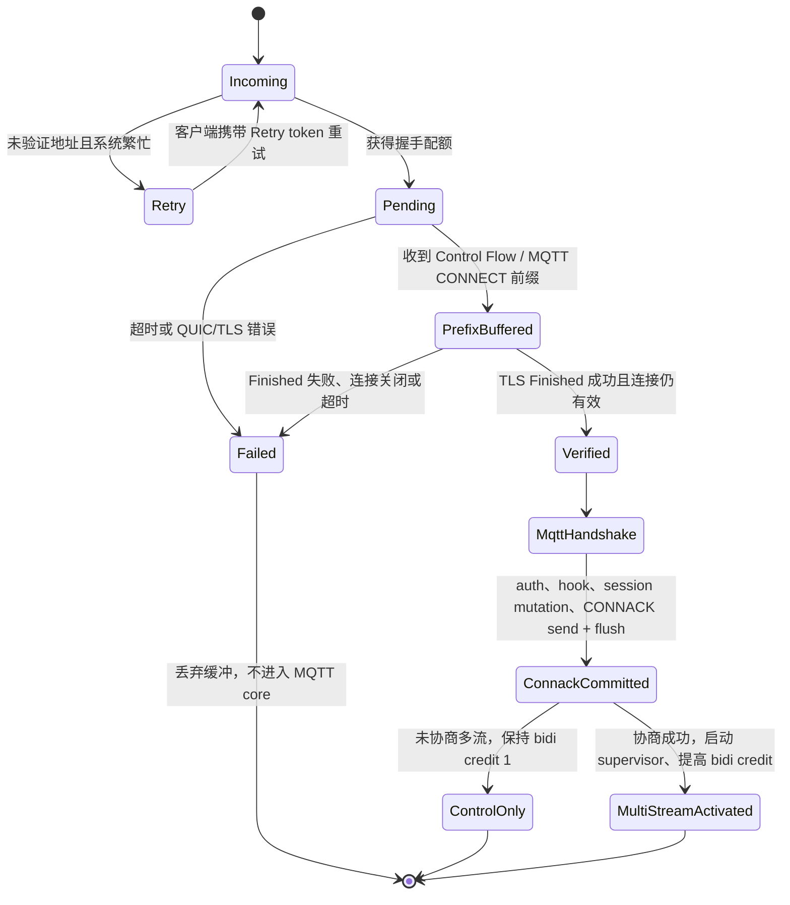

# MQTT over QUIC 0-RTT 数据重放防护方案

状态：第一版已实现
适用范围：RMQTT `support-0RTT` 分支，MQTT 3.1.1 / MQTT 5.0 over QUIC
研究依据：[mqtt-quic-0rtt-replay-research.md](./mqtt-quic-0rtt-replay-research.md)
多流组合设计：[mqtt-quic-multistream.md](./mqtt-quic-multistream.md)

## 1. 决策摘要

RMQTT 第一版只提供一种安全的 0-RTT profile：**handshake-gated CONNECT-only**。

其含义不是“在 0-RTT 阶段执行 MQTT CONNECT”，而是：

1. 客户端可以提前发送第一个 MQTT CONNECT 的字节；
2. Broker 在 TLS Finished 之前最多做有界的协议前缀探测和缓冲；
3. 认证 hook、外部认证、踢旧连接、Clean Start / Clean Session、Will 注册、会话创建、CONNACK，以及任何 PUBLISH / SUBSCRIBE / AUTH 处理，都必须在 TLS Finished 被确认成功之后发生；
4. TLS ticket 使用 listener/node-local 的有状态单次消费存储；
5. ticket miss、cache eviction、节点重启或路由到错误节点时，自动退化为 1-RTT，而不是报业务错误；
6. 多 Stream listener 在握手 transport parameters 中只开放一条 client bidi stream；只有多流协商成功且 CONNACK send + flush commit 后才动态开放 Data Flow；
7. 第一版不引入 MQTT nonce、CONNECT 指纹缓存或集群 replay ledger。

一句话概括：**0-RTT 只提前传输，不提前产生业务副作用。**

这是本方案最重要的安全边界，也是优先于所有缓存、nonce 和分布式锁的防线。

## 2. 威胁模型

### 2.1 攻击者能力

假设攻击者可以：

- 捕获并原样重放 ClientHello、QUIC 0-RTT STREAM 数据和 CONNECT 密文；
- 抢在合法客户端之前重放，消耗一次性 ticket；
- 向同一节点、不同节点或不同可用区重复发送 captured flight；
- 建立大量未完成握手、发送部分 CONNECT 或畸形 MQTT 前缀；
- 观察连接是否成功，但不能破解 TLS、获得 PSK，或为新的服务端握手计算合法的 Client Finished。

### 2.2 需要保护的副作用

重放不得导致以下动作发生：

- `client_connect`、`client_authenticate` 等 hook 被调用；
- 外部 HTTP/JWT/ACL 认证请求被重复触发；
- 相同 ClientId 的旧连接被踢下线；
- Clean Start / Clean Session 清理旧会话；
- Will 被注册、替换或发布；
- session、subscription、retained message 或离线消息状态被修改；
- CONNACK 或其他依赖客户端身份的应用数据在 Finished 前发送；
- PUBLISH、SUBSCRIBE、UNSUBSCRIBE、AUTH 等数据面/控制面包被提前执行。

### 2.3 可接受的剩余风险

本方案允许重放造成有限的资源消耗，例如：

- 消耗一个 session ticket，使合法客户端退化到 1-RTT；
- 占用一次受限的握手槽位、少量 QUIC 缓冲和协议探测 CPU；
- 触发 QUIC Retry 或连接超时。

这些属于可缓解的 DoS 风险，不允许升级为 MQTT 状态或外部系统副作用。

### 2.4 非目标

- 不阻止一个已经合法认证的客户端主动多次重连或多次发布；
- 不为业务 PUBLISH 提供跨连接 exactly-once 语义；
- 不解决终端 PSK、session ticket 或客户端凭据已泄露后的攻击；
- 不把 MQTT QoS 2 等同于 0-RTT replay protection。

## 3. 实现状态

当前实现已经落下本方案的 P0 安全边界：

- `rmqtt-net` 使用有状态、原子 `take` 的 TLS session store，并禁用 stateless ticket；
- endpoint 初始只授予 1 条 client-initiated bidi Control Flow，uni stream credit 为 0；
- `Listener::next_quic()` 先占用共享握手许可，只返回轻量 `QuicIncoming`；
- `QuicIncoming::accept_control()` 使用同一个截止时间完成 QUIC 建连、首条 Control Flow 接收和 TLS Finished 栅栏；
- Finished 前不调用 MQTT codec/version probe，因此应用层读取字节数为 0；transport receive window 仍按 `pre_finished_read_budget` 限制 Quinn 的早期缓冲；
- `handshake_data()` 必须存在且 `close_reason()` 必须为空，才会返回 `AcceptedQuicControl`；
- `server.rs` 不再接触裸 `ZeroRttAccepted`，旧的 `accept_quic()` 兼容入口也复用同一验证路径；
- CONNACK send + flush 成功后，typestate token 才允许提高 bidi stream credit 并启动 Data Flow supervisor。

在 Quinn 服务端，`ZeroRttAccepted` future 的布尔结果不是“服务端是否接受 early data”的业务 verdict，当前实现只把 future 完成当作栅栏信号并忽略该布尔值。若攻击者重放早期 CONNECT 后无法完成新的 Finished，Broker 会在超时、握手数据缺失或连接已关闭时 fail closed，不会把早期 MQTT 字节交给 v3/v5。

## 4. 核心安全不变量

实现和代码审查必须始终验证以下不变量：

1. **Finished gate**：只有已验证成功的 QUIC/TLS 连接能进入 MQTT v3/v5 处理器。
2. **No pre-Finished side effect**：Finished 前不调用 hook、auth、shared/session、Will、CONNACK 或插件接口。
3. **No 0.5-RTT application response**：保持 rustls `send_half_rtt_data = false`，应用层在 Finished 前不写响应。
4. **Control-only early stream**：Finished 与 CONNACK send + flush commit 之前，每个 MQTT/QUIC 连接只允许一条被服务端接受的 client-initiated bidirectional Control Flow；其 early 数据只能是第一个 CONNECT。多流协商成功时，commit 后才可把 bidi stream credit 动态提高到 `1 + max_data_streams`；未协商连接始终保持 1。单向 stream 第一版始终为 0。
5. **Stateful single-use ticket**：可用于 0-RTT 的 TLS 1.3 ticket 必须由原子 `take` 的有状态存储消费，禁止 stateless ticket 进入 0-RTT 路径。
6. **Safe fallback**：ticket miss、重放、过期、容量淘汰、进程重启或错误节点都只导致 0-RTT 失败和 1-RTT 重发。
7. **Bounded pre-auth work**：Finished 前的连接数、读取字节、缓冲、解析工作和等待时间都有上限。
8. **Client exactly-one fallback**：客户端收到 early data rejected 后只重发一次 CONNECT，不同时等待早期 CONNACK 和重复创建多个 fallback stream。

## 5. 推荐架构

### 5.1 模块边界

推荐在 `rmqtt-net` 内增加一个 QUIC/MQTT ingress 深模块，隐藏 Quinn 和 rustls 的脆弱调用顺序：

```rust
pub enum QuicZeroRttMode {
    Disabled,
    HandshakeGated,
}

pub struct QuicIncoming {
    // quinn::Incoming、listener policy、handshake permit；字段均为 private
}

pub struct AcceptedQuicMqtt {
    pub control: MqttStream<QuinnBiStream>,
    pub meta: QuicIngressMeta,
    // activation handle 为 private；只能在 CONNACK send + flush commit 后的 typestate 使用
}

pub struct QuicIngressMeta {
    pub received_early_stream: bool,
    pub remote_addr: SocketAddr,
    pub address_was_validated: bool,
}

impl Listener {
    pub async fn next_quic(&self) -> Result<QuicIncoming>;
}

impl QuicIncoming {
    pub async fn accept_control(self) -> Result<AcceptedQuicMqtt>;
}
```

内部还应存在一个不导出的 pending 状态，它在校验完成前同时持有 `Connection`、完成 future 和 MQTT stream：

```rust
struct PendingQuicMqtt {
    connection: quinn::Connection,
    completed: quinn::ZeroRttAccepted,
    control: MqttStream<QuinnBiStream>,
    permit: OwnedSemaphorePermit,
}
```

只有 `PendingQuicMqtt::verify(self)` 能构造公开的 `AcceptedQuicMqtt`；任何字段都不能被 `server.rs` 提前取走。Control writer 对 CONNACK 完成 send + flush commit 后，再由私有 activation handle 启动 Data Flow supervisor 并提高 stream credit。

`QuicIncoming::accept_control()` 内部负责：

- `Incoming::accept()` / `Connecting::into_0rtt()`；
- 首个双向 Control Flow 的接收；
- Finished 前不运行 MQTT 版本探测；Quinn transport window 只允许有界早期缓冲；
- TLS Finished 完成信号与 `Connection::close_reason()` 等连接成功状态的联合校验；
- 握手超时、失败时丢弃所有早期缓冲；
- 释放 pre-Finished semaphore permit；
- 成功后才构造并返回 `AcceptedQuicMqtt`；
- 不接受、不缓冲、不启动任何 Data Flow task。

完成栅栏应把 Quinn 的布尔值仅视为“future 已结束”的信号，而不是服务端的 early-data verdict。当前依赖版本可采用如下形态，并以回归测试锁定：

```rust
async fn await_verified_finished(
    connection: &quinn::Connection,
    completed: quinn::ZeroRttAccepted,
    deadline: tokio::time::Instant,
) -> Result<()> {
    // 服务端不得把该 bool 解释为 early-data acceptance verdict。
    let _ = timeout_at(deadline, completed)
        .await
        .map_err(|_| anyhow!("Timed out waiting for authenticated QUIC Finished"))?;
    if connection.handshake_data().is_none() {
        return Err(anyhow!("QUIC handshake data is unavailable"));
    }
    if let Some(reason) = connection.close_reason() {
        return Err(anyhow!("QUIC handshake did not establish a usable connection: {reason}"));
    }
    Ok(())
}
```

若后续 Quinn 提供直接返回握手成功/失败的服务端 API，应在 ingress 内替换实现，但不能改变“失败绝不返回 MQTT stream”的外部合同。升级 Quinn 时必须重新运行 gate contract tests，不能把客户端的 `accepted: bool` 语义套到服务端，也不能继续假设 incoming success 恒为 `true` 而不核对新版本源码/文档。

`rmqtt/src/server.rs` 只能拿到 `AcceptedQuicMqtt`，不能拿到 pending stream 或裸 `ZeroRttAccepted`。v3/v5 完成 CONNECT/auth，且 Control writer 对 CONNACK 的 send + flush 成功后，才能把它转换为 `QuicMultiStreamLink`。这样把“忘记检查 Finished”和“CONNACK commit 前开放 Data Flow”都变成不可表达的错误。

### 5.2 状态机



### 5.3 正常与重放时序

正常路径：

1. 客户端使用上次连接获得的 ticket，发送 ClientHello + Control Flow 的 CONNECT；
2. rustls 对 ticket 做原子 `take`，验证 binder、age、ALPN 和 transport resumption 条件；
3. ingress 只探测 MQTT 版本并保留字节，不调用 MQTT core；
4. 合法客户端完成新的 TLS Finished；
5. ingress 返回 verified Control Flow；
6. v3/v5 正常解析 CONNECT、认证并创建会话。
7. 仅在多流协商成功时，CONNACK send + flush commit 后才提高 `MAX_STREAMS` 并接受 Data Flow；否则保持 Control-only。

被动重放路径：

1. 攻击者重放 ClientHello + CONNECT；
2. 若 ticket 已消费，rustls 拒绝 early data，连接可继续走 full handshake；攻击者无法完成，最终关闭；
3. 若攻击者抢先消费 ticket，Broker 可能暂存 CONNECT 前缀，但攻击者仍无法为新握手生成合法 Finished；
4. Finished gate 返回错误并丢弃缓冲；
5. 合法客户端发现 early data rejected，重新在已完成的 1-RTT 连接上发送 CONNECT；
6. 全程没有 hook、踢旧会话、Will、CONNACK 或其他 MQTT 副作用。

## 6. TLS ticket 防线

### 6.1 第一版策略

每个 QUIC listener 使用 node-local、stateful、single-use session store：

```rust
#[derive(Debug)]
pub struct ReplaySafeSessionStore {
    // bounded cache<Entry { tls_value, insertion_time, profile_fingerprint }> + metrics
}

pub struct ZeroRttProfileFingerprint {
    // hash(ALPN/protocol set, initial stream limits, credential profile,
    //      multistream mode, packet/read limits, auth_policy_epoch)
}

impl rustls::server::StoresServerSessions for ReplaySafeSessionStore {
    fn put(&self, key: Vec<u8>, value: Vec<u8>) -> bool;
    fn get(&self, key: &[u8]) -> Option<Vec<u8>>;
    fn take(&self, key: &[u8]) -> Option<Vec<u8>>; // 必须原子返回并删除
    fn can_cache(&self) -> bool;
}
```

实现约束：

- `take` 必须在同一临界区内完成查找和删除；
- cache 必须有容量和本地 TTL；
- `put` 时记录当前 `ZeroRttProfileFingerprint`，`get` / `take` 只返回 fingerprint 完全匹配的 session；不匹配等价于 ticket miss 并退化到 1-RTT；
- 不记录 ticket key、PSK 或 session value；
- store 不可用或达到安全失败条件时，不签发新的 0-RTT-capable ticket；
- 对 rustls 0.23 的 TLS 1.3 路径，以 `put(...) == false` 作为“不签发该 ticket”的权威信号；`can_cache()` 仅保留 trait 兼容和 advisory 语义；
- `ticketer` 必须保持 disabled；
- 不在认证策略、证书身份或 ALPN 不等价的 listener 之间共享 store。

fingerprint 中必须包含显式 `auth_policy_epoch`。Broker 无法稳定 hash 任意认证插件的外部策略，因此认证规则、token audience、credential profile 或插件配置发生安全相关变化时，运维/配置加载器必须提高该 epoch。多流 enablement、初始 bidi/uni limit、early CONNECT read budget、ALPN/协议集合等可由配置自动计算进 fingerprint。

当前 rustls 默认 `ServerSessionMemoryCache` 已经使用锁内原子删除，且默认 stateless ticketer 关闭；显式 store 的价值是把容量、TTL、指标和安全约束变成 RMQTT 可配置、可测试的合同，而不是依赖隐式默认值。

### 6.2 为什么不用 CONNECT 指纹缓存

不建议以 `ClientId + CONNECT hash + IP` 作为主 replay key：

- 相同 CONNECT 在正常重连中是合法的；
- IP 在 NAT、移动网络和 QUIC migration 下不稳定；
- Finished 前没有可信的 MQTT 身份；
- 指纹不能替代 TLS ticket 的 binder、freshness 和 ALPN 绑定；
- 会引入误杀、额外内存以及新的集群一致性问题。

ticket 身份由 TLS 层消费，正好位于正确的安全和 locality 边界。

## 7. MQTT 0-RTT profile

### 7.1 客户端允许行为

- 只在第一条 client-initiated bidirectional Control Flow 上发送 early 数据；
- early data 中只允许发送第一个 CONNECT，可分片，但不得追加 PUBLISH、SUBSCRIBE、UNSUBSCRIBE、AUTH、PINGREQ 或 DISCONNECT；
- 在客户端侧 `ZeroRttAccepted == true` 且收到 CONNACK 前，不发送任何后续 MQTT 包；服务端不得复用该 bool 语义；
- 若 0-RTT 未被接受，丢弃早期 stream 状态，在同一个已完成握手的 QUIC connection 上新开 stream，并只重发一次 CONNECT；
- 若 early stream 的读写先返回 `ZeroRttRejected`，也进入同一个 fallback 状态；该错误与 `accepted == false` 只能触发同一份 once-only 重发；
- 不得先无限等待早期 CONNACK 再判断 0-RTT 是否被接受，否则在 early data rejected 时可能形成客户端死锁。
- CONNACK send + flush commit 前不得创建 Data Flow；上一连接收到的动态 `MAX_STREAMS` 不能用于下一连接的 0-RTT。

客户端状态建议使用单一状态机保证重发幂等：

```text
Initial
  -> EarlyConnectSent
      -> accepted=true  -> WaitConnack
      -> accepted=false -> FallbackConnectSent -> WaitConnack
  -> OneRttConnectSent  -> WaitConnack
  -> Connected
```

### 7.2 Broker 行为

- Finished 前最多探测 CONNECT 固定头、remaining length、协议名和协议版本；
- 不需要在 Finished 前完整解析 username、password、Will 或 properties；
- 整个 CONNECT 即使已被 Quinn 缓冲，也必须在 verified gate 后才交给 v3/v5；
- malformed early prefix 在 Finished 前不返回 MQTT CONNACK；可静默关闭、Retry 或使用受限的 QUIC transport close；
- 正常 MQTT 错误映射只在 Finished 后使用。
- 多流 listener 只有在当前 connection 协商成功且 CONNACK send + flush commit 后才进入 `Activated`，随后才动态提高 bidi stream credit；未协商 connection 保持 1；任何 pre-activation extra stream 都不得触发 MQTT core。

### 7.3 凭据限制

TLS 1.3 0-RTT 不具备 forward secrecy。即使本方案阻止重放副作用，也不能消除长期凭据进入 early data 的保密风险。

该限制必须成为可执行的配置合同，而不只是运行时解析后的检查。Broker 在 Finished 后才看到完整 CONNECT；此时再拒绝长期 password 已经无法撤销其进入 0-RTT 密文、缺少 forward secrecy 的事实。

建议增加显式配置：

```toml
[listener.quic.external.zero_rtt]
mode = "handshake_gated"
credential_profile = "short_lived_token" # deny | anonymous | short_lived_token
auth_policy_epoch = 1
```

强制策略：

- `credential_profile` 默认 `deny`，未显式声明时不得启用 0-RTT；
- 只允许匿名 listener 或受控的短期、可撤销 token profile；
- `short-lived-token` profile 必须关闭 listener 的匿名访问；
- MQTT 3.1.1 和 MQTT 5 listener 只要允许长期 username/password，默认关闭 0-RTT；
- 0-RTT-capable 客户端 SDK 必须拒绝把长期 password 写入 early CONNECT；
- MQTT 5 可在 Finished 后继续 enhanced authentication，但不能把长期 Authentication Data 提前发送；
- mTLS + 0-RTT 第一版继续保持不兼容。

Broker 无法自动判断任意插件 token 是否真的“短期”；因此启用 `short-lived-token` 是需要审计的运维声明，至少应约束 token TTL、受众、listener、ClientId/主体绑定和撤销方式。

## 8. 资源型重放与 DoS 防护

业务副作用被 Finished gate 阻断后，剩余重点是把 pre-auth 成本做成有界。

### 8.1 QUIC transport 限制

- endpoint 建立前必须调用 `transport_config.max_concurrent_bidi_streams(1_u8.into())`；
- 同时调用 `transport_config.max_concurrent_uni_streams(0_u8.into())`；
- CONNACK send + flush commit 前保持 bidi credit 为 1；
- commit 后，本地先进入 `Activated` 并启动带 phase guard 的 supervisor，再调用 `set_max_concurrent_bi_streams(1 + max_data_streams)`；
- Control Flow 结束时关闭整个 QUIC connection；Data Flow 生命周期按多流设计独立管理；
- 根据 listener 的 `max_packet_size` 设置合理的 `stream_receive_window` 和 `receive_window`；
- 保留有限 `max_idle_timeout` 和独立的 handshake timeout；
- 不把 `max_early_data_size` 当普通字节上限配置：QUIC/rustls 只接受 `0` 或 `0xffffffff`，实际内存边界应由 flow control、读取预算和并发限制实现。

动态提高的 `MAX_STREAMS` 只授权 1-RTT Data Flow。ticket 中记住的初始 bidi limit 必须保持为 1；部署该策略时应清空或换代此前可能记住更高 limit 的 resumption ticket。

### 8.2 pre-Finished 配额

每个 listener 至少维护：

- 全局 pending handshake semaphore；
- 每 IP 或 IPv4 `/24`、IPv6 `/56` 前缀的速率限制；
- pre-Finished read budget；
- 版本探测 CPU/错误计数限制；
- 单连接和总握手超时。

不要在 listener accept loop 内等待首个 stream；先接收 `Incoming`，再由持有 permit 的任务处理。

上述 `next_quic()` 拆分、pending semaphore、Control Flow `accept_bi()` timeout、prefix read timeout/budget、初始 bidi-stream limit 和 CONNACK commit activation gate 都是启用 0-RTT 前的 P0 条件，不是事后性能优化。

### 8.3 地址验证与 Retry

使用 Quinn `Incoming::remote_address_validated()` / `may_retry()`：

- 正常负载下允许快速路径；
- pending 数、内存或错误率超过阈值时，对未验证地址发送 QUIC Retry；
- 无法取得 permit 时优先 Retry，其次 ignore/refuse；
- Retry 会牺牲 0-RTT 延迟，因此采用 adaptive，而不是无条件开启。

## 9. 集群策略

### 9.1 推荐：ticket node-local

第一版不在 RMQTT cluster-broadcast、Redis 或 Raft 上同步 TLS replay state。

- ticket 只在签发它的 listener/process 上可用；
- 路由到其他节点、进程重启或 cache eviction 时，0-RTT 被拒绝，客户端退化到 1-RTT；
- 若命中率重要，可使用负载均衡 affinity 或 ticket-owner 路由，但安全性不依赖 affinity；
- 不为了提高命中率而把 eventual-consistent store 放到 anti-replay 路径。

这种 locality 选择把最坏情况限制为“少一次性能收益”，而不是“跨节点重复执行 MQTT 副作用”。

### 9.2 未来共享 ticket 的要求

若未来必须让同一 ticket 在多个节点可恢复，则共享 store 的 `take` 必须是跨节点线性一致的原子消费。不能使用 broadcast 或普通最终一致 Redis GET/DEL 组合。

还需注意 rustls `StoresServerSessions` 是同步接口，把 Raft/远程 RPC 直接塞进 TLS 握手热路径会造成阻塞和可用性耦合。优先顺序应是：

1. ticket-owner 路由；
2. 无法路由时安全退化到 1-RTT；
3. 最后才评估低延迟、线性一致的共享 session store。

## 10. 备选方案比较

本设计并行评估了四种形态：

| 方案 | 优点 | 问题 | 结论 |
| --- | --- | --- | --- |
| A. transport ingress + CONNECT 指纹 cache | 接口小，v3/v5 基本不变 | 指纹不是可靠 TLS replay identity，可能误杀正常重连 | 采用 ingress；不采用指纹 cache |
| B. MQTT token + policy + replay ledger | 可支持按 listener/client/packet 放行真正的 early execution | 接口和失败模式多，集群 RTT 抵消 0-RTT 收益，MQTT 3.1.1 缺少干净 token carrier | 仅保留为未来 MQTT 5 扩展 |
| C. operator policy + local cache + 自动降级 | 运维友好，有 Retry、指标和 fallback 概念 | Quinn 不暴露适合另建 cache 的稳定 ticket key；rustls 已在正确层完成 ticket 消费 | 采用 policy/fallback/metrics；cache 放在 rustls store |
| D. AdmissionGate + local/Raft adapters | 端口边界清晰，可测试强一致 reserve/consume | 在不做 pre-Finished 业务执行时属于重复机制，增加延迟和依赖 | 第一版不采用 |

最终选择是 A 与 C 的收敛版本：

- 用深 ingress 模块隐藏 Finished gate；
- 用 rustls session store 承担单次 ticket 消费；
- 用 listener-local policy、资源限制、Retry 和指标改善可运维性；
- 不让 MQTT core 和 cluster hot path 感知 replay ledger。

## 11. 可观测性

建议增加以下指标，均按 listener 标识，避免高基数 ClientId 标签：

- `quic_early_stream_received_total`；
- `quic_finished_success_after_early_total`；
- `quic_finished_failure_after_early_total`；
- `quic_handshake_timeout_total`；
- `quic_ticket_store_put_total`；
- `quic_ticket_take_hit_total`；
- `quic_ticket_take_miss_total`；
- `quic_ticket_evicted_total`；
- `quic_retry_issued_total`；
- `quic_prefinished_limit_rejected_total`；
- `quic_prefinished_connections`；
- `quic_prefinished_bytes`；
- `quic_handshake_duration_seconds`。

指标来源必须和实现 seam 对齐：

| 指标类别 | 唯一可信采集点 |
| --- | --- |
| ticket put/take hit/miss/evict | `ReplaySafeSessionStore` 内部 |
| early Control Flow、Finished success/failure、timeout | `PendingQuicMqtt::verify` |
| Retry、pending limit | `Listener::next_quic` |
| pre-Finished bytes | ingress 的 limited reader / stream wrapper |
| hook/auth/kick/CONNACK 零副作用断言 | 测试专用 hook、shared/session spy 和 stream writer spy |

日志禁止输出原始 ticket、PSK、password、Authentication Data 或完整 CONNECT。Finished 前不记录未经认证的 ClientId；确需关联时只记录短期、带 salt 的摘要。

## 12. 失败语义

| 场景 | Broker 行为 | 客户端行为 |
| --- | --- | --- |
| ticket 已消费/过期/淘汰 | 不处理 early stream，继续 full handshake | 握手完成后重发一次 CONNECT |
| 路由到错误节点 | 同上 | 同上 |
| captured replay 抢先消费 ticket | 暂存有限前缀；Finished 失败后全部丢弃 | 合法连接退化为 1-RTT |
| Finished 失败或连接提前关闭 | 不进入 v3/v5，不发送 CONNACK | 新建正常连接 |
| pending 配额不足 | adaptive Retry、ignore 或 refuse | 按 QUIC 重试策略连接 |
| session store 不可用 | fail closed for early data，不签发新 0-RTT ticket | 使用 1-RTT |
| MQTT CONNECT 非法 | Finished 后按正常 MQTT 规则关闭/拒绝 | 修正协议请求 |

## 13. 验证计划

### 13.1 单元测试

- 100 个并发 `take` 使用同一 ticket，恰好一个返回 session；
- ticket TTL、容量淘汰，以及 `put=false` 时不签发可恢复 ticket / 不获得 0-RTT capability；`can_cache()` 只做兼容性/advisory 测试；
- Finished signal 后 connection 有 close reason 时 gate 返回错误；
- 锁定 Quinn 0.11.9 时，completion future 只作为完成栅栏；handshake data 缺失或 close reason 非空使 gate fail closed，bool 不解释为服务端 early-data acceptance verdict；
- Finished timeout、stream timeout 和 prefix read budget；
- pending permit 在所有错误路径都被释放；
- fallback state machine 在多个失败信号同时发生时只重发一次 CONNECT。
- `ZeroRttProfileFingerprint` 任一安全字段或 `auth_policy_epoch` 改变后，旧 ticket 只能退化到 1-RTT。

### 13.2 集成测试

- 合法 0-RTT CONNECT 成功，并且 CONNACK 在 Finished 后发送；
- 发送 early CONNECT 后在 Finished 前中断连接：hook/auth/kick/session/Will/CONNACK 计数全部为 0；
- 同一 ticket 并发重放：最多一次 early acceptance，合法客户端可通过 1-RTT 完成；
- 重放者抢先 burn ticket：无 MQTT 副作用，原客户端 fallback 成功；
- cache eviction、节点重启、错误节点都能无业务错误降级；
- Finished/CONNACK commit 前第二个双向 stream 和所有单向 stream 被 transport limit 阻止；
- 上一次连接已启用 Data Flow 后，使用其 ticket 的下一次 0-RTT 仍只能建立 Control Flow；
- CONNACK send + flush commit 后只开放配置数量的 Data Flow，pre-activation extra stream 的 MQTT 副作用为 0；
- 客户端 early rejected 后不会等待永远，也不会重复发送两次 fallback CONNECT；
- 畸形、截断、超大 CONNECT 的 fuzz/property tests；
- adaptive Retry 和 pending 限制下的资源上界压测。

### 13.3 安全验收条件

抓包重放测试中，无论重放次数、顺序或目标节点如何，只要攻击者不能完成新的 TLS Finished，就必须满足：

```text
auth_hook_calls      == 0
external_auth_calls  == 0
session_kicks        == 0
session_mutations    == 0
will_registrations   == 0
connack_sent         == 0
publish_processed    == 0
```

## 14. 分阶段落地

### P0：修复安全边界

- 引入 verified Finished gate；
- 失败或 close reason 非空时丢弃 stream；
- 把 pending QUIC Control Flow 隐藏在 ingress 深模块内；
- 将 endpoint accept 与 `accept_bi()` 拆开，避免单个慢客户端阻塞 accept loop；
- 加入 pending semaphore、`accept_bi()`/prefix/Finished timeout 与 pre-Finished read budget；
- endpoint transport config 初始调用 `max_concurrent_bidi_streams(1)`、`max_concurrent_uni_streams(0)`；只有 CONNACK send + flush commit 后才动态开放 Data Flow；Control Flow 结束时关闭 QUIC connection；
- 清空或换代可能记住较高初始 stream limit 的旧 resumption ticket；
- 对 0-RTT listener 强制校验 `credential_profile`，长期 password profile 不能启动 0-RTT；
- 增加“early bytes + Finished 失败 = 零副作用”回归测试。

### P1：显式单次 ticket 与资源限制

- 配置并测试 `ReplaySafeSessionStore`；
- 加入 adaptive Retry、IP/prefix rate limit 和更细的资源指标；
- 加入 replay/0-RTT 指标；
- 实现客户端 accepted/rejected fallback 状态机。

### P2：灰度与运维

- 0-RTT 继续默认关闭，按 listener 灰度；
- 先在无长期 password、无 mTLS 的 listener 开启；
- 观察 ticket miss、Finished failure、Retry 和 fallback 比例；
- 异常时只需切回 `Disabled`，不影响正常 QUIC 1-RTT。

### P3：可选的真正 early execution

只有明确需要在 Finished 前执行 MQTT 业务动作时，才引入 MQTT 5 one-time token + `reserve/commit/revoke` ledger，并限制到无 Will、无 Clean Start、无 enhanced auth、身份和 ClientId 固定的窄 profile。该模式需要独立威胁模型和安全评审，不属于本方案第一版。

## 15. 规范与实现依据

- [TLS 1.3 RFC 8446 §8：0-RTT 与 anti-replay](https://datatracker.ietf.org/doc/html/rfc8446#section-8)
- [QUIC TLS RFC 9001 §9.2：0-RTT replay](https://datatracker.ietf.org/doc/html/rfc9001#section-9.2)
- [QUIC RFC 9000 §4.6：0-RTT transport parameters 与 rejection](https://datatracker.ietf.org/doc/html/rfc9000#section-4.6)
- [QUIC RFC 9000 §7.4.1：0-RTT remembered transport parameters](https://www.rfc-editor.org/rfc/rfc9000.html#section-7.4.1)
- [QUIC RFC 9000 §19.11：MAX_STREAMS](https://www.rfc-editor.org/rfc/rfc9000.html#section-19.11)
- [Quinn 0.11.9 `Connecting::into_0rtt`](https://docs.rs/quinn/0.11.9/quinn/struct.Connecting.html)
- [rustls 0.23.40 `ServerConfig`](https://docs.rs/rustls/0.23.40/rustls/server/struct.ServerConfig.html)
- [rustls 0.23.40 `StoresServerSessions`](https://docs.rs/rustls/0.23.40/rustls/server/trait.StoresServerSessions.html)
- [MQTT 3.1.1 OASIS Standard](https://docs.oasis-open.org/mqtt/mqtt/v3.1.1/os/mqtt-v3.1.1-os.html)
- [MQTT 5.0 OASIS Standard](https://docs.oasis-open.org/mqtt/mqtt/v5.0/os/mqtt-v5.0-os.html)
