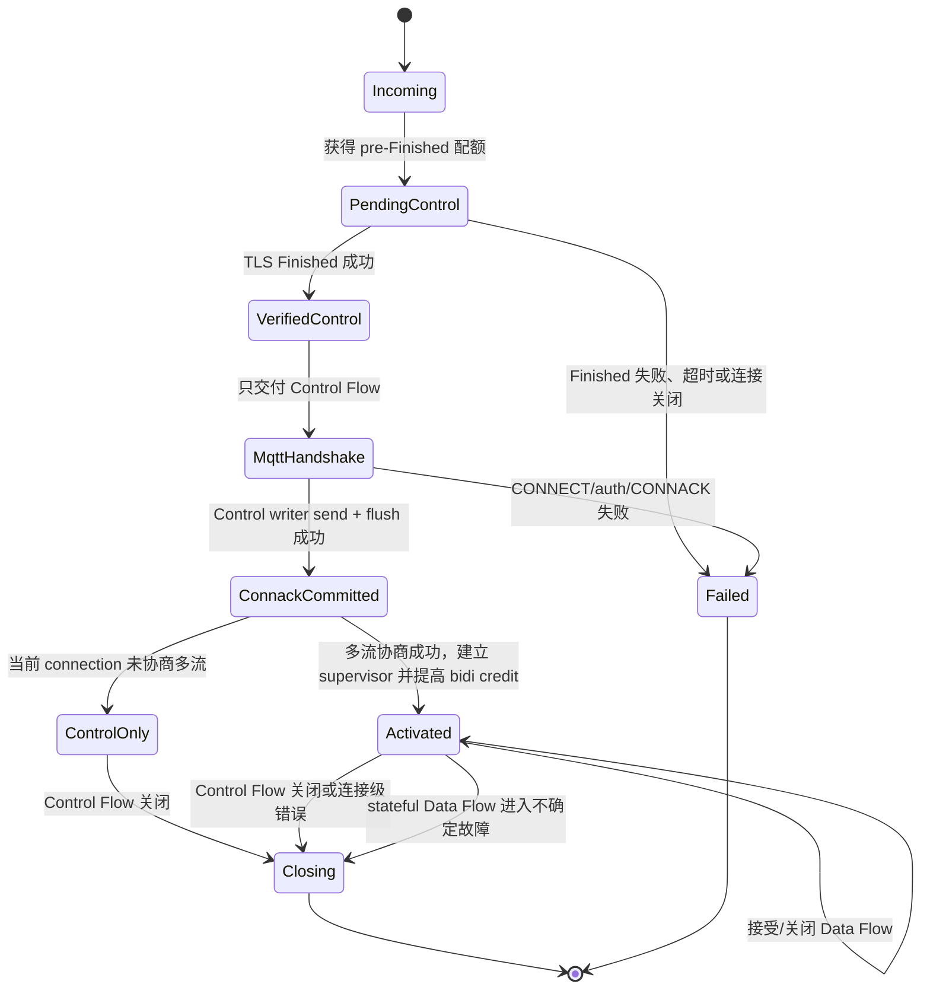

# MQTT over QUIC 多 Stream 设计方案

状态：第一版已实现
适用范围：RMQTT `support-0RTT` 分支，MQTT 3.1.1 / MQTT 5.0 over QUIC
研究依据：[mqtt-quic-multistream-research.md](./mqtt-quic-multistream-research.md)
安全前置：[mqtt-quic-0rtt-replay-protection.md](./mqtt-quic-0rtt-replay-protection.md)

## 1. 决策摘要

RMQTT 第一版采用 **Simple Multistream** profile：

1. 一个 QUIC connection 只对应一个 MQTT Network Connection 和一个 MQTT session；
2. 服务端实际接受的第一条 client-initiated bidirectional stream 是持久的 **Control Flow**；
3. Control Flow 承载 CONNECT、CONNACK、AUTH、PING、DISCONNECT，并可作为所有 MQTT 包的兼容 fallback；
4. 只有 TLS Finished 已验证、CONNECT/auth 成功且 Control writer 对 CONNACK 的 send + flush 已 commit 后，Broker 才允许额外的 client-initiated bidirectional **Data Flow**；
5. Data Flow 可承载 PUBLISH/QoS ACK 链和 SUBSCRIBE/UNSUBSCRIBE 事务，响应必须回到发起事务的同一条 flow；
6. MQTT Packet Identifier、Receive Maximum、session、inflight、Keep Alive 和 Will 始终是连接/会话级状态，不能按 flow 分片；
7. QUIC 只保证单 flow 内有序。RMQTT 不承诺跨 flow 全局顺序；有因果或顺序关系的数据必须放到同一 flow；
8. MQTT 5 Topic Alias 在第一版多流 profile 中禁用；
9. flow binding 是当前 QUIC connection 的临时状态，不写入持久 MQTT session；
10. 第一版不使用 server-initiated stream、unidirectional stream、QUIC DATAGRAM、每消息一 stream 或持久 FlowId。

0-RTT 与多流的组合规则只有一句话：

> **0-RTT 只能提前携带 Control Flow 上的第一个 CONNECT；Data Flow 必须等 Finished + CONNACK 后才能出现。**

该 profile 是 RMQTT 的可选扩展，不是已发布的 OASIS MQTT multistream 标准。跨产品互操作必须通过兼容测试确认，不能仅凭 MQTT 版本号或 `mqtt` ALPN 推断。

## 2. 目标与非目标

### 2.1 目标

- 避免某个慢 topic 或大 PUBLISH 阻塞 PING、认证和其他独立 topic；
- 让客户端按 topic、QoS 或发布/订阅方向选择独立 flow；
- 保持现有 RMQTT session actor 对全局 MQTT 状态的单点所有权；
- 保持单 stream 客户端可只使用 Control Flow；
- 与 handshake-gated CONNECT-only 的 0-RTT replay 防线组合，而不是扩大 early-data 执行面；
- 把 Quinn stream、Finished gate、flow task 和 reset 细节隐藏在 transport 深模块内。

### 2.2 非目标

- 不提供跨 flow 的全局消息顺序；
- 不提供跨连接 exactly-once；
- 不把每条 QUIC stream 变成独立 MQTT session；
- 不在第一版持久化 flow、订阅到 flow 的绑定或 stream priority；
- 不自动把有歧义的 QoS 事务从故障 flow 迁移到另一 flow；
- 不承诺和任意第三方 MQTT-over-QUIC multistream 实现线级兼容。

## 3. 为什么不能只循环 `accept_bi()`

改造前实现从 `Listener::accept_quic()` 接受一条双向 stream，`server.rs` 将这一条 stream 交给 v3/v5，`SessionState::run` 再围绕一个 `Sink` 串行处理收发。当前实现已把该边界替换为 `QuicIncoming -> AcceptedQuicControl -> ConnackCommitted -> QuicMultiStreamLink` typestate 链。

直接把 `accept_bi()` 放进循环会破坏以下隐含合同：

- 不知道哪一条 stream 拥有 CONNECT/CONNACK 和连接关闭权；
- 同一 Packet Identifier 可能在不同 stream 被重复占用；
- ACK 可能在错误 stream 上完成另一个 flow 的 QoS 状态机；
- Keep Alive、Will、session takeover 和 Topic Alias 的所有权变得分散；
- 多个 reader task 会并发修改同一 session；
- 0-RTT 客户端可能利用上一连接记住的 stream credit 提前打开数据流；
- stream reset 会被误认为整个 MQTT connection 关闭，或反过来漏掉真正的连接关闭。

因此需要一个真实的 transport seam：上层看见的是一个 MQTT link 及其逻辑 flow，不是若干裸 Quinn stream。

## 4. Wire profile

### 4.1 Control Flow

Control Flow 是服务端在当前 QUIC connection 上实际接受的第一条 client-initiated bidirectional stream，并持续到 MQTT connection 结束。若 0-RTT 被拒绝，客户端本地已失效的 early stream 不计入该定义；post-handshake fallback stream 成为服务端可见的 Control Flow。

Control-only 包：

- CONNECT / CONNACK；
- MQTT 5 AUTH；当前 RMQTT 明确拒绝 enhanced auth，未来支持时仍只能走 Control Flow；
- PINGREQ / PINGRESP；
- DISCONNECT；
- Broker 发出的连接级错误和关闭通知。

为保持 single-stream 兼容，Control Flow 也允许 PUBLISH、PUBACK/PUBREC/PUBREL/PUBCOMP、SUBSCRIBE/SUBACK、UNSUBSCRIBE/UNSUBACK。未启用多流的客户端无需改变现有行为。

Control Flow reset、读端 EOF 或不可恢复的 codec 错误都等价于 MQTT Network Connection 丢失：停止全部 Data Flow，执行现有 disconnect/session/Will 语义，并关闭 QUIC connection。

### 4.2 Data Flow

成功 CONNACK 后，客户端可以建立零到多条额外的双向 Data Flow。第一版不增加自定义 stream header；所有 Data Flow：

- 自动继承 Control Flow 已确定的 MQTT 3.1.1 或 MQTT 5.0 codec；
- 可以连续承载多个 MQTT Control Packet；
- 由客户端自行按 topic、QoS 或 publish/subscribe 方向分配；
- 只能在当前 QUIC connection 内使用，不能跨连接恢复；
- 不允许 CONNECT、CONNACK、AUTH、PINGREQ、PINGRESP 或 DISCONNECT。

客户端可以采用以下映射，但 RMQTT 不强制固定 lane：

- 一个 topic 或一组有序 topic 使用同一 flow；
- QoS 0、QoS 1、QoS 2 使用不同 flow；
- uplink publish 和 downstream subscription 使用不同 flow；
- 所有数据继续走 Control Flow。

### 4.3 完整 packet/phase 矩阵

`握手阶段 Control` 指 Finished 已验证但成功 CONNACK 尚未 commit。0-RTT 阶段比该列更严格，只允许第一个 CONNECT 的字节。

| Packet family | 方向 | 握手阶段 Control | Activated Control | Activated Data | 非法 Data Flow 处理 |
| --- | --- | --- | --- | --- | --- |
| CONNECT | Client → Broker | 必须是第一包，只允许一次 | 禁止重复 | 禁止 | 关闭 connection |
| CONNACK | Broker → Client | 只能由 handshake commit 发送 | 禁止重复 | 禁止 | 内部不变量失败，关闭 connection |
| AUTH（MQTT 5） | 双向 | 未来支持时仅 Control；当前 RMQTT 拒绝 | 未来 re-auth 仍仅 Control | 禁止 | 关闭 connection |
| PUBLISH | 双向 | client 在完整 CONNECT 后到达的 1-RTT 包可有界排队，但 CONNECT/auth 成功前不执行；Broker 不发送 | 允许 | 允许 | 按 codec/QoS 错误分类 |
| PUBACK / PUBREC / PUBREL / PUBCOMP | 双向 | 不执行；无合法事务时属于协议错误 | 允许，必须匹配 route | 允许，必须匹配同 flow route | wrong-flow 或非法 stage 关闭 connection |
| SUBSCRIBE | Client → Broker | 1-RTT 可有界排队，CONNACK commit 前不执行 | 允许 | 允许 | malformed/PacketId 冲突关闭 connection |
| SUBACK | Broker → Client | 不发送 | 允许，回复原 flow | 允许，回复原 flow | 发送路径不匹配属于内部错误 |
| UNSUBSCRIBE | Client → Broker | 1-RTT 可有界排队，CONNACK commit 前不执行 | 允许 | 允许 | malformed/PacketId 冲突关闭 connection |
| UNSUBACK | Broker → Client | 不发送 | 允许，回复原 flow | 允许，回复原 flow | 发送路径不匹配属于内部错误 |
| PINGREQ / PINGRESP | Client → Broker / Broker → Client | 不执行/不发送 | 仅 Control | 禁止 | reset Data Flow；不刷新 Keep Alive |
| DISCONNECT | 双向，按 MQTT 版本规则 | 仅 Control；终止 handshake/session | 仅 Control | 禁止 | 关闭 connection |

所有 packet 必须先通过 phase、flow-kind、direction 和 MQTT version 校验，再刷新 Keep Alive 或进入 session actor。若 CONNECT 最终被拒绝，握手阶段排队的后续包全部丢弃。

### 4.4 同 flow 响应

以下事务必须在发起包所在 flow 完成：

| 发起包 | 同 flow 响应/后续链 |
| --- | --- |
| QoS 1 PUBLISH | PUBACK |
| QoS 2 PUBLISH | PUBREC → PUBREL → PUBCOMP |
| SUBSCRIBE | SUBACK；成功订阅绑定该 flow |
| UNSUBSCRIBE | UNSUBACK；成功后移除对应绑定 |
| Broker 下行 QoS 1/2 PUBLISH | 客户端 ACK 链回到发送该 PUBLISH 的 flow |

ACK 出现在其他 flow 时，不能只按 Packet Identifier 接受。它属于连接级协议/安全错误，因为错误 ACK 可能提前释放 inflight、复用 Packet Identifier 或破坏 QoS 2 状态机。

### 4.5 协商

第一版保持现有 MQTT QUIC ALPN，并把多流作为 listener 上的 opt-in profile：

- MQTT 5 客户端应在 CONNECT User Property 请求 `rmqtt-quic-multistream=simple-v1`；Broker 只在 CONNACK 中明确接受后启用 Data Flow；
- MQTT 3.1.1 没有 User Property，必须使用专用 listener/端口或双方预配置；
- 只看到额外 QUIC stream credit 不等价于应用层协商成功；客户端仍必须等成功 CONNACK；
- 未协商或不支持的客户端始终使用 Control Flow。

若未来需要严格隔离非 RMQTT 客户端，应单独设计并登记专用 ALPN；第一版不自行宣称一个未注册 ALPN 是标准值。

## 5. 连接状态机



激活顺序必须是：

1. 验证 TLS Finished，失败时丢弃 Control Flow 缓冲；
2. 在 Control Flow 完成 MQTT CONNECT/auth/session takeover；
3. Control Flow writer 对 CONNACK 执行 `send` + `flush`，两者都成功后生成不可伪造的 `ConnackCommitted` token；这只表示本地 writer 已提交，不表示 peer 已收到；
4. 若 send/flush 失败或被 backpressure timeout，关闭 connection，绝不提高 stream credit；
5. 若当前 connection 未协商多流，进入 `ControlOnly`，bidi credit 永久保持 1；
6. 若已协商，使用 token 构造 `Activated` link，启动带 phase guard 的 Data Flow accept supervisor；
7. 最后把远端可并发双向 stream 数提高到 `1 + max_data_streams`。

即使网络重排使客户端先看到 `MAX_STREAMS`，客户端也不得在解析成功 CONNACK 前发送 Data Flow。Broker 对未处于 `Activated` 状态的额外 stream 做 reset/close，且不得产生 MQTT 副作用。

## 6. 0-RTT 与 stream credit

### 6.1 初始 transport 参数

0-RTT-capable listener 必须在 QUIC endpoint 建立前设置：

```rust
let transport_config = Arc::get_mut(&mut server_config.transport).unwrap();
transport_config.max_concurrent_bidi_streams(1_u8.into());
transport_config.max_concurrent_uni_streams(0_u8.into());
```

这一个 bidi credit 只供 Control Flow 使用。不能先使用 Quinn 默认值，再在 accept 后降到 1，因为客户端可能已经依据握手参数或旧 ticket 打开额外 stream。

### 6.2 CONNACK 后动态放开

Quinn 0.11 提供：

```rust
connection.set_max_concurrent_bi_streams((1 + policy.max_data_streams).into());
```

该调用通过 QUIC `MAX_STREAMS` 增加 peer 可打开的 stream 数。RFC 9000 规定，0-RTT packet 只能使用 ticket 记住的 transport parameters；握手或 1-RTT frame 提高的额度只能用于 1-RTT。因此：

- ticket 记住的 `initial_max_streams_bidi` 始终是 1；
- 上一次连接在 CONNACK 后收到的动态 `MAX_STREAMS` 不能授权下一次连接的 early Data Flow；
- 接受 0-RTT 时，服务端不能把记住的初始额度降到更小，但可以在握手后提高额度；
- 任何在 0-RTT 中使用第二条 client bidi stream 的行为都违反 remembered limit，必须在 transport/ingress 边界失败。

升级到本 profile 时必须清空或换代旧 listener 的 resumption ticket store。若旧 ticket 记住的初始 stream 数大于 1，不能继续接受其 0-RTT。

### 6.3 early rejection fallback

客户端的 fallback 状态机只管理 Control Flow：

- early data accepted：继续等待 Control Flow 的 CONNACK；
- early data rejected：丢弃本地 early stream 状态，在完成握手的同一 QUIC connection 上只新开一条 fallback Control Flow，并只重发一次 CONNECT；
- 在成功 CONNACK 前绝不创建 Data Flow；
- fallback 和 early stream 的失败信号必须汇合为一次性状态转换，不能重复建立两个 Control Flow。

## 7. 深模块与接口

### 7.1 模块、seam 与 adapters

| 设计概念 | 位置与责任 |
| --- | --- |
| module | `rmqtt-net::quic_ingress` 隐藏 Finished、0-RTT、stream credit 和 accept supervisor |
| interface | `MqttLink`、`LinkEvent`、`ReplyPath` 是 session-facing 合同 |
| seam | `server.rs` 只接收 verified pending link；不接触裸 `ZeroRttAccepted` 或 `quinn::Connection` |
| adapter | `SerialMqttLink` 适配 TCP/TLS/WS/单流 QUIC；`QuicMultiStreamLink` 适配多流；`MemoryMqttLink` 用于测试 |
| depth | flow task、codec、reset、buffer、priority 和 connection cancellation 都留在 `rmqtt-net` |
| leverage | v3/v5 auth、SessionState、inflight、subscription、Will 和 hook 保持一套实现 |
| locality | ticket/policy 属于 listener；flow registry 属于 connection；MQTT 状态属于 session |

建议的 transport-neutral 形态：

```rust
pub struct FlowId(/* opaque: connection epoch + stream identity */);

pub struct ReplyPath {
    flow: FlowId,
    generation: u64,
}

pub enum FlowKind {
    Control,
    Data,
}

pub enum LinkEvent<P> {
    Packet {
        packet: P,
        kind: FlowKind,
        reply: ReplyPath,
    },
    FlowClosed {
        flow: FlowId,
        reason: FlowCloseReason,
    },
    ConnectionClosed(ConnectionCloseReason),
}

pub enum SendTarget {
    Control,
    Reply(ReplyPath),
    Bound(FlowId),
}

pub struct SendReceipt {
    pub path: ReplyPath,
}

pub struct PendingMqttLink<P> {
    control: ControlChannel<P>,
    activation: ActivationHandle,
}

pub struct ConnackCommitted {
    _private: (),
}

pub struct MqttHandshakeReady<P> {
    session: SessionState,
    pending: PendingMqttLink<P>,
    commit: ConnackCommitted,
}

impl<P> PendingMqttLink<P> {
    async fn send_connack_and_commit(&mut self, connack: P) -> Result<ConnackCommitted>;
}

impl<P> MqttHandshakeReady<P> {
    async fn activate_streams(self, policy: StreamPolicy) -> Result<(SessionState, ActiveMqttLink<P>)>;
}

#[async_trait]
pub trait MqttLink<P> {
    async fn recv(&mut self) -> Result<LinkEvent<P>>;
    async fn send(&self, target: SendTarget, packet: P) -> Result<SendReceipt>;
    async fn reset_flow(&self, flow: FlowId, reason: FlowCloseReason) -> Result<()>;
    async fn close_connection(&self, reason: ConnectionCloseReason) -> Result<()>;
}
```

`FlowId` 字段必须私有，session core 不应依赖 Quinn 的 stream ID 编码。`ReplyPath` 还包含 connection generation，避免旧连接/旧 flow 的迟到事件影响 session takeover 后的新连接。

### 7.2 使用形态

```rust
let pending = listener.next_quic().await?.accept_control().await?;
let ready: MqttHandshakeReady<_> = mqtt_handshake(pending).await?;
let (mut session, mut link) = ready.activate_streams(policy).await?;

while let Some(event) = link.recv().await? {
    session.handle(event).await?;
}
```

`mqtt_handshake` 需要从当前 v3/v5 `process` 中拆出 handshake 阶段：完成 CONNECT/auth/session setup 后，由 `PendingMqttLink::send_connack_and_commit` 执行 Control writer `send` + `flush`，成功才构造 `ConnackCommitted` 和 `MqttHandshakeReady`。`activate_streams` 只存在于该 typestate 上。Serial adapter 的 activation 是 no-op；QUIC adapter 才启动 supervisor 和提高 credit。这样把“CONNACK 提交前开放 Data Flow”变成接口上不可表达的错误。

### 7.3 内部并发模型

- 每条 flow 由独立 task 持有 `Framed<QuinnBiStream, MqttCodec>`；
- 每个 task 只按 stream 内字节顺序解码，并写入有界 connection mailbox；
- 一个 session actor 串行处理所有 `LinkEvent`，继续独占 hook、session、inflight、Packet Identifier、Keep Alive 和 Will；
- Control Flow 使用独立保留队列/容量，避免被 Data Flow 队列挤满；
- Data Flow 使用公平轮询，不能让一个高流量 flow 永久饿死其他 flow；
- mailbox 的消费顺序只是 Broker 的处理顺序，不构成跨 flow 的协议顺序承诺。

## 8. MQTT 状态所有权

### 8.1 Packet Identifier 与 Receive Maximum

- client → server 和 server → client 各自只有一套连接级 Packet Identifier namespace；
- 同一 issuer 的不同 flow 不得同时使用相同未完成 Packet Identifier；Client-issued 与 Server-issued 可合法同号；
- Receive Maximum 对所有 Data Flow 与 Control Flow 的 QoS 1/2 PUBLISH 合计生效；
- transport flow-control credit 不能替代 MQTT Receive Maximum；
- session actor 维护按事务发起方分离的 route ledger，并验证每个 ACK 的方向、flow、事务 family 和 QoS 阶段。

路由键和值必须显式区分两个合法的同号 namespace：

```rust
pub enum PacketIssuer {
    Client,
    Server,
}

pub struct PacketRouteKey {
    pub issuer: PacketIssuer,
    pub packet_id: NonZeroU16,
}

pub struct PacketRouteEntry {
    pub family: TransactionFamily, // PublishQos1/2 | Subscribe | Unsubscribe
    pub stage: TransactionStage,
    pub path: ReplyPath,
}
```

同一个数值 Packet Identifier 可以同时存在于 Client-issued 和 Server-issued ledger；同一 issuer 内则跨 PUBLISH/SUBSCRIBE/UNSUBSCRIBE 也必须保持唯一。收到 ACK 时先根据 packet direction/family 推导被确认事务的 issuer，再查 `(issuer, packet_id)`；不能只查裸 `packet_id`。

建议 route 状态：

```text
Unbound
  -> Active(flow, qos_stage)
  -> Completed
  -> Uncertain(flow_failure) -> CloseConnection   # v1
```

第一版不从 `Uncertain` 自动迁移到另一 flow。跨流重传需要同时处理旧 flow 迟到 ACK、QoS 2 中间阶段和 DUP 标记，错误实现会比关闭连接更危险。

### 8.2 Subscription binding

SUBSCRIBE 在某条 flow 成功后，该 packet 内成功创建/更新的 topic filter 绑定到该 flow。为避免 SUBACK、retained message 和并发 live delivery 出现不稳定竞态，binding 使用两阶段状态：

```text
PendingAck(flow) -> Active(flow)
```

处理顺序固定为：

1. 现有 session/subscription 模块提交成功的 topic filters；
2. retained/stored/live delivery producer 只可写入现有有界 session mailbox；session actor 仍在串行处理 SUBSCRIBE，不能提前消费这些消息；
3. actor 安装 `PendingAck(flow)`，并在同一 flow 对 SUBACK 执行 send + flush；
4. 成功后切换为 `Active(flow)`；actor 随后才继续消费 session mailbox，因此 retained、stored 和 live delivery 都按新 binding 路由且不会越过 SUBACK；
5. SUBACK commit 失败时关闭 connection，交给持久 session/re-subscribe 语义恢复。

MQTT 标准允许 Broker 在 SUBACK 前开始发送匹配 PUBLISH；RMQTT Simple Multistream 有意选择更严格且确定的 SUBACK-first policy。

其他 binding 规则：

- SUBACK 必须返回同一 flow；
- retained message、订阅建立时触发的 stored message 和后续下行 PUBLISH 都走该 active flow；
- 同一 topic filter 在另一 flow 上重新 SUBSCRIBE 成功后，最新 binding 替换旧 binding；
- UNSUBSCRIBE 成功后移除相应 binding；
- session reconnect 时恢复的 subscription、offline queue、自动订阅或没有 active binding 的订阅走 Control Flow；
- binding 只存在于当前 connection，不进入持久 session。

重叠订阅先由现有 MQTT subscription/session 逻辑决定交付次数、QoS 和 Subscription Identifier，再由 transport routing 为每个逻辑交付选择一条 active flow。若多个匹配 binding 都可用，使用稳定的最小 connection-local flow ordinal；不能因存在多条 flow 额外复制消息。

### 8.3 Topic Alias

MQTT 5 Topic Alias 是 network-connection scoped 的有序映射。跨 flow 更新和使用时没有全局到达顺序，同一个 alias 还可能被不同 flow 竞争重定义。

因此，对已经协商 `simple-v1` 的 connection，第一版：

- CONNACK 中 `Topic Alias Maximum = 0`；
- Broker 不在下行 PUBLISH 中发送 Topic Alias；
- 客户端在多流 profile 中发送非零 Topic Alias 按正常 MQTT 协议错误处理；
- 未来若引入 per-flow alias，必须通过新的显式 extension 协商，不能假装它仍是标准 MQTT connection-wide alias。

未协商多流、始终停留在 `ControlOnly` 的连接可以继续使用现有 single-stream Topic Alias policy；不能因为 listener 支持多流就无条件改变所有客户端的 CONNACK。

### 8.4 Keep Alive、DISCONNECT 与 Will

- 任意 active flow 上通过 phase/packet 校验并完整解码一个 MQTT Control Packet，才刷新同一连接的 Keep Alive 时钟；partial bytes、非法 flow packet 和仅打开空 stream 都不刷新；
- PINGREQ/PINGRESP 只能走 Control Flow，并给 Control Flow 最高发送优先级；
- Data Flow 的任一方向终止本身不触发 Will；只有升级为 connection failure 时才走连接级 Will 判断；
- Control Flow reset、QUIC connection close、Keep Alive timeout 或连接级协议错误走现有 disconnect/Will 路径；
- 客户端若要求某些 Data Flow 包一定先于 DISCONNECT 生效，必须先等待相应 ACK；跨 flow 没有隐含 happens-before。

### 8.5 session persistence

- subscription、QoS inflight 和离线消息仍按 ClientId/session 规则持久化；
- FlowId、subscription binding、flow priority 和 mailbox sequence 不持久化；
- session resume 后，所有 restored subscription 和待重发消息先走 Control Flow；
- 客户端可以通过新的 SUBSCRIBE 重新建立 Data Flow binding；
- session takeover 会取消旧 connection 的全部 flow task，旧 generation 的迟到事件必须被丢弃。

## 9. 顺序与因果规则

QUIC 对每条 stream 提供有序字节流，但不对不同 stream 提供全局顺序。RMQTT 明确定义：

- 同一 flow 内按 MQTT packet 解码顺序处理；
- 不同 flow 的 PUBLISH 之间无顺序保证；
- SUBSCRIBE 在 flow A、PUBLISH 在 flow B 并发时，没有“订阅一定先建立”的保证；客户端必须等待 SUBACK，或把有因果关系的包放在同一 flow；
- 两个相关 topic 若需要顺序，必须映射到同一 flow；
- QoS 只描述交付保证，不会创造跨 flow 的全局顺序；
- Broker 不以接收 task 调度时间、QUIC packet number 或 wall clock 伪造跨 flow total order。

## 10. flow failure 语义

### 10.1 双向 stream 的方向性终态

QUIC 的两个方向独立：receive side 可能收到 FIN/`RESET_STREAM`，send side 可能收到 `STOP_SENDING` 或本地写失败。第一版把 Data Flow 定义为逻辑上的持久 full-duplex flow；任一方向进入终态时先转入 `Draining`：

1. 停止接受该 flow 的新事务和新发送；
2. 按终态发生前的 route ledger 判断是否存在 stateful transaction；
3. 主动终止另一方向并等待/记录其终态；
4. 最终只发出一个去重的 `FlowClosed` event。

`FlowCloseReason` 至少区分：

```text
RecvFinished
RecvReset(application_code)
SendStopped(application_code)
SendFailed(error)
IdleTimeout
CodecMalformed
ConnectionLost
```

| 方向事件 | Data Flow | Control Flow |
| --- | --- | --- |
| clean FIN，且无 stateful transaction | Draining 后关闭该 flow | 关闭 MQTT/QUIC connection |
| receive reset，完整 packet 尚未形成且无 stateful transaction | 丢弃 partial packet，Draining 后关闭 flow | 关闭 connection |
| send stopped / send failed | 有 QoS1/2、QoS2 stage 或 pending response 时关闭 connection；否则关闭 flow | 关闭 connection |
| codec malformed / PacketId 或 QoS 状态错误 | 关闭 connection | 关闭 connection |
| idle timeout | 安全时关闭 flow | 交给连接 Keep Alive/idle policy |
| underlying connection lost | 关闭 connection | 关闭 connection |

特别地，下行 QoS 1/2 已写出但 send side 收到 `STOP_SENDING` 时，不能按“receive side 还开着”继续 session；它直接命中 `close-if-stateful`。

### 10.2 可隔离的 flow-local failure

以下情况可以只关闭 Data Flow，保持 MQTT connection：

- 对端正常结束一条空闲 flow；
- stream idle timeout；
- stream 在完整 MQTT packet 形成前 reset，且该 flow 没有未完成 stateful transaction；
- QoS 0 发送失败；消息按 QoS 0 语义允许丢失；
- extension-specific packet-family violation，且没有污染连接级状态。

关闭后：

- 删除该 flow 的 subscription binding；
- 没有 active binding 的后续下行消息 fallback 到 Control Flow；
- 不触发 Will；
- 客户端可在额度和速率限制内新开 Data Flow 并重新 SUBSCRIBE。

### 10.3 必须升级为 connection failure

以下情况关闭整个 MQTT/QUIC connection：

- Control Flow 关闭、reset 或 codec 失败；
- 任意 flow 出现 MQTT malformed packet、Packet Identifier 冲突、Receive Maximum 超限或非法 QoS 状态转换；
- ACK 出现在错误 flow；
- Data Flow 携带 CONNECT、AUTH 或 DISCONNECT 等连接级包；
- Data Flow 故障时存在未完成 QoS 1/2、QoS 2 中间状态、待发送 SUBACK/UNSUBACK，或其他“业务状态已提交但 peer 是否收到结果”不确定事务；
- aggregate buffer、flow count 或内部不变量被破坏。

MQTT 5 尽可能在 Control Flow 发送合适的 DISCONNECT reason 后关闭；MQTT 3.1.1 直接关闭。若 session 持久，后续重连使用现有 MQTT retransmission/session resume 语义恢复。

这个 `close-if-stateful` 规则有意牺牲部分 stream 故障隔离，换取第一版 QoS 正确性。只有在 route ledger、迟到 ACK 和跨流重传得到独立验证后，才考虑 `reroute-stateful` 模式。

## 11. 资源与 DoS 边界

建议配置形态：

```toml
[listener.quic.external.multistream]
mode = "simple"                 # disabled | simple
max_data_streams = 8
stream_open_rate = 32            # per connection / second
stream_idle_timeout = "60s"
connection_mailbox_packets = 256
connection_buffer_bytes = "1MB"
topic_alias = "disabled"
flow_failure_policy = "close-if-stateful"
```

必须同时限制：

- listener pending handshake 数；
- 每连接 active Data Flow 数和新建速率；
- 每 flow 解码缓冲、最大 MQTT packet 和 idle timeout；
- 每连接所有 flow 的 aggregate buffer/mailbox；
- 每 listener 的总 flow task 数；
- MQTT Receive Maximum 与 inbound/outbound inflight；
- Data Flow accept、首包和完整 packet 的超时。

QUIC stream limit 只限制并发 stream，不限制恶意客户端反复 close/open 的速率，因此必须有 application-level open-rate limiter。

发送优先级第一版只保证 Control Flow 高于 Data Flow。Simple profile 没有可靠的 flow class header，Broker 不应仅根据第一条 PUBLISH 猜测整条 flow 的 QoS priority。

## 12. 可观测性

建议指标：

- `mqtt_quic_control_flow_active`；
- `mqtt_quic_data_flows_active`；
- `mqtt_quic_data_flow_opened_total`；
- `mqtt_quic_data_flow_closed_total{reason}`；
- `mqtt_quic_preactivation_flow_rejected_total`；
- `mqtt_quic_wrong_flow_ack_total`；
- `mqtt_quic_packet_id_conflict_total`；
- `mqtt_quic_stateful_flow_failure_close_total`；
- `mqtt_quic_control_fallback_total{cause}`；
- `mqtt_quic_stream_open_rate_limited_total`；
- `mqtt_quic_connection_buffer_rejected_total`；
- `mqtt_quic_packets_total{flow_kind,packet_family}`。

不要把 raw StreamId、ClientId、topic 或 Packet Identifier 作为常规 metric label。调试日志可记录 connection-scoped 短 flow ordinal，但不得跨连接当作身份。

## 13. 验证计划

### 13.1 0-RTT / activation

- 初始 bidi stream credit 恰好为 1、uni 为 0；
- 上一次已激活多流的 ticket 在下一次 0-RTT 中仍只能创建 Control Flow；
- Finished 前第二条 bidi stream 无 MQTT 副作用；
- CONNACK writer send + flush 成功前不调用 `set_max_concurrent_bi_streams(1 + N)`；
- CONNACK write failure、flush failure、backpressure timeout 都不启动 supervisor、不提高 stream credit；
- 成功 CONNACK 后最多 N 条 Data Flow 可并发工作；
- MQTT 5 未请求/未接受多流时 bidi credit 保持 1，Topic Alias 继续使用 ordinary single-stream policy；
- early rejection 只建立一次 fallback Control Flow，且不建立 early Data Flow；
- 旧 ticket policy epoch 不匹配时拒绝 0-RTT、退化到 1-RTT。

### 13.2 ordering / routing

- 同一 flow 内 packet 顺序保持；
- 不编写依赖跨 flow 固定处理顺序的测试；
- 相关 topic 置于同一 flow 时顺序保持；
- SUBSCRIBE/SUBACK、UNSUBSCRIBE/UNSUBACK 和 QoS ACK 链均保持同 flow；
- SUBACK commit 前 binding 为 `PendingAck`，retained/stored/live delivery 不越过 SUBACK-first barrier；
- 重叠订阅不会因多个 binding 额外重复投递；
- dead binding fallback 到 Control Flow。

### 13.3 QoS / session

- Client-issued 与 Server-issued 可以同时使用相同数值 Packet Identifier，两个 ledger 不冲突；
- 同一 issuer 在不同 flow 或不同 transaction family 并发复用相同 Packet Identifier 会关闭连接；
- ACK direction/family 解析错误不能命中另一 issuer 的同号事务；
- wrong-flow PUBACK/PUBREC/PUBREL/PUBCOMP 不会释放 inflight；
- Receive Maximum 是所有 flow 合计，而不是每 flow 一份；
- Data Flow 任一方向终止且存在 QoS 1/2 inflight 时关闭连接；
- 持久 session 重连后使用相同 Packet Identifier/DUP 规则恢复；
- QoS 2 duplicate 不会重复提交业务消息；
- session takeover 后旧 flow 的迟到事件不影响新 connection generation。

### 13.4 lifecycle / security

- 可隔离的 Data Flow 方向终态不触发 Will；
- Control Flow reset、Keep Alive timeout 触发正常断连/Will；
- 任意 flow 的合法 packet 都刷新 Keep Alive；
- partial packet、非法 Data Flow PING 和空 stream churn 不刷新 Keep Alive；
- receive reset、send stopped、clean FIN、idle、codec error 的分类测试覆盖 connection/flow 关闭差异；
- PING 只走 Control Flow，且在数据拥塞下仍能及时收发；
- Topic Alias Maximum 为 0，非零 alias 被拒绝；
- malformed、超大、截断 packet 的 fuzz/property tests 覆盖每条 flow；
- flow churn、慢读、慢写和 aggregate buffer 压测满足资源上界。

## 14. 备选方案比较

| 方案 | 优点 | 问题 | 结论 |
| --- | --- | --- | --- |
| 每个 PUBLISH 新建一条 stream | 隔离最强，单消息 HOL 小 | stream churn、QoS/ACK 生命周期复杂、资源攻击面大 | 第一版拒绝 |
| 固定 QoS/topic lanes | 实现和调度较简单 | 过早固化策略，客户端负载差异大 | 不作为 wire contract |
| Control + client-chosen reusable Data Flow | 保持兼容，映射灵活，和现有实践接近 | 必须明确 ordering、binding、QoS 和 reset | 第一版采用 |
| 带 Flow header、持久 FlowId、server-initiated flow | 可恢复、可显式协商 priority/class | 新 wire protocol，标准化和状态机成本高 | 后续 advanced profile |
| 把 Quinn stream 直接暴露给 SessionState | 类型少 | QUIC 细节扩散，测试和安全边界变浅 | 拒绝 |
| `MqttLink` port + serial/QUIC/memory adapters | seam 稳定，session 状态保持集中，测试 leverage 高 | 需要重构单 `Sink` 假设 | 采用 |

## 15. 分阶段落地

### P0：安全入口和单 Control Flow

- 完成 verified Finished gate；
- endpoint 建立前调用 Quinn `TransportConfig::max_concurrent_bidi_streams(1)`、`max_concurrent_uni_streams(0)`；
- 用 typestate 保证 CONNACK 前不能激活 Data Flow；
- 把裸 Quinn/ZeroRtt 状态收进 `quic_ingress`；
- 清理或换代旧 resumption ticket。

### P1：MqttLink seam 与基础多流

- 引入 `MqttLink`、`FlowId`、`ReplyPath`、serial adapter 和 memory adapter；
- QUIC accept supervisor + per-flow codec task；
- Control fallback、Data Flow packet allowlist、Keep Alive 合并；
- bounded mailbox、flow semaphore、open-rate 和 idle timeout。

### P2：QoS 与 subscription routing

- 全局 Packet Identifier / Receive Maximum 验证；
- issuer-scoped `PacketRouteLedger` 和 wrong-flow ACK 防护；
- subscription binding、overlap deterministic routing；
- `close-if-stateful` failure policy；
- session resume/takeover 回归测试。

### P3：灰度与互操作

- 默认 `disabled`，按 listener 开启；
- 先测 Control-only compatibility，再测 RMQTT multistream client；
- 与 EMQX/NanoMQ 等实现做显式互操作矩阵，但不预设兼容；
- 观察 flow churn、fallback、stateful close、PING latency 和内存。

### P4：可选 advanced profile

只有真实需求和独立协议评审通过后，再评估：

- 显式 Flow header / FlowId；
- per-flow Topic Alias；
- stateful transaction 跨流迁移；
- server-initiated downlink flow；
- QoS 0 unidirectional flow 或 QUIC DATAGRAM；
- 持久 flow binding 和 priority negotiation。

## 16. 验收不变量

实现完成必须同时满足：

```text
one_quic_connection == one_mqtt_session
early_data_flows     == control_only
data_flow_activation > finished_and_successful_connack
packet_id_namespace  == connection_global_per_direction
receive_maximum      == connection_global
topic_alias_maximum  == 0
wrong_flow_ack       == rejected_without_state_release
data_flow_reset      != will_trigger
control_flow_reset   == mqtt_connection_lost
cross_flow_order     == not_guaranteed
```

## 17. 规范与实现依据

- [RFC 9000：QUIC streams、flow control、MAX_STREAMS 与 0-RTT transport parameters](https://www.rfc-editor.org/rfc/rfc9000.html)
- [RFC 9001：QUIC 0-RTT replay](https://www.rfc-editor.org/rfc/rfc9001.html)
- [MQTT 5.0 OASIS Standard](https://docs.oasis-open.org/mqtt/mqtt/v5.0/mqtt-v5.0.html)
- [MQTT 3.1.1 OASIS Standard](https://docs.oasis-open.org/mqtt/mqtt/v3.1.1/os/mqtt-v3.1.1-os.html)
- [Quinn 0.11 `Connection`](https://docs.rs/quinn/0.11.9/quinn/struct.Connection.html)
- [EMQX MQTT over QUIC multistream features](https://docs.emqx.com/en/emqx/latest/mqtt-over-quic/features-mqtt-over-quic.html)
- [OASIS MQTT repository：MQTT over QUIC single-stream contribution](https://raw.githubusercontent.com/oasis-tcs/mqtt/43280f255b94cf4710c90dd453f59781be97ca91/contributions/EMQX/mqtt-over-quic-cn/mqtt_over_quic_single_stream_CN_1.md)
